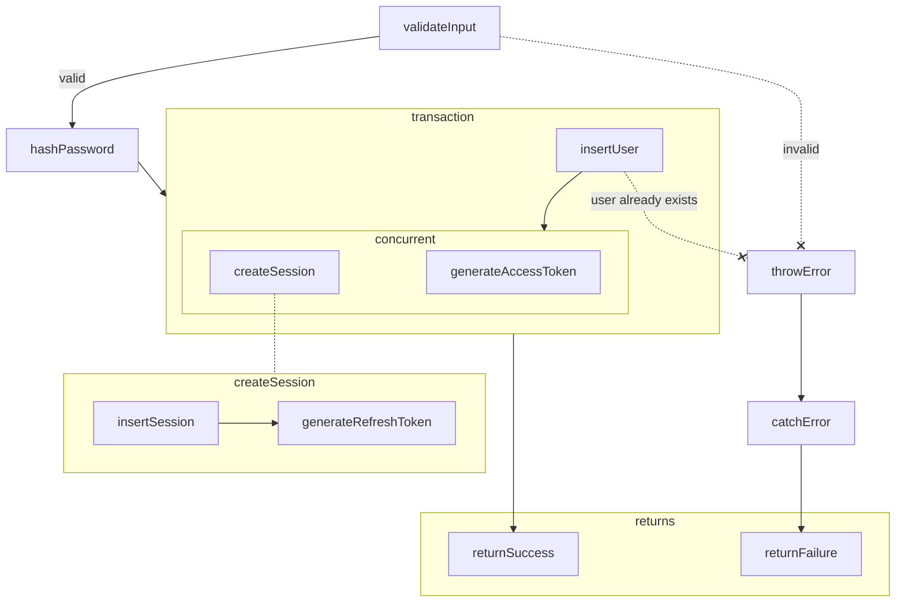
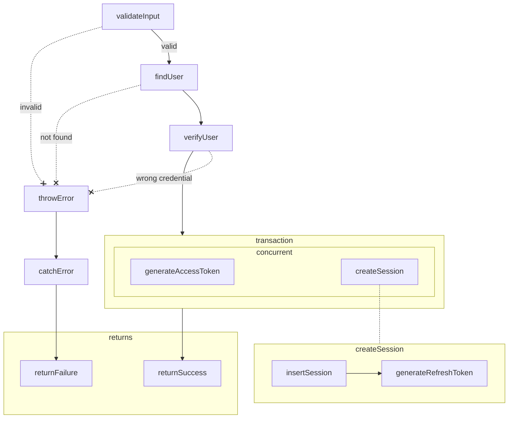
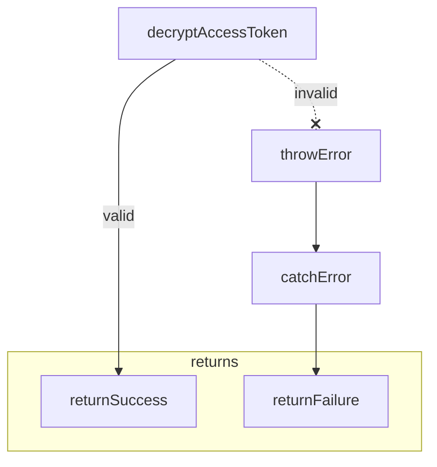
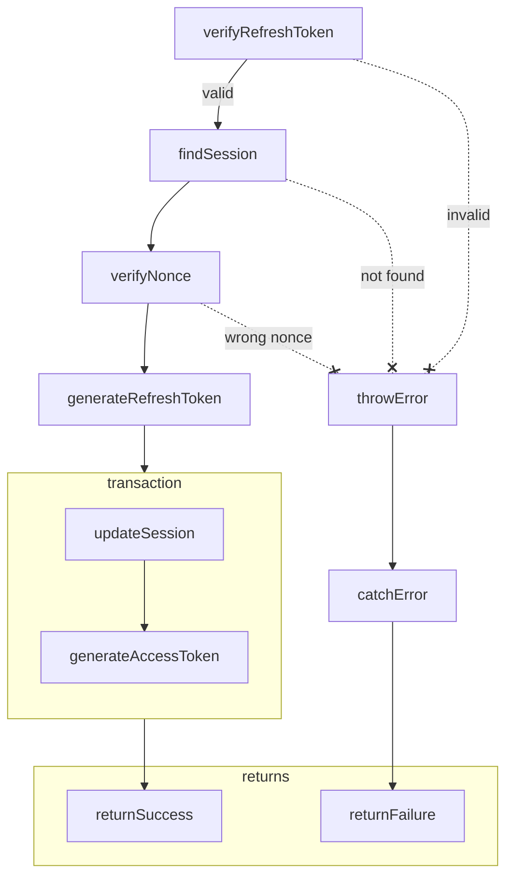
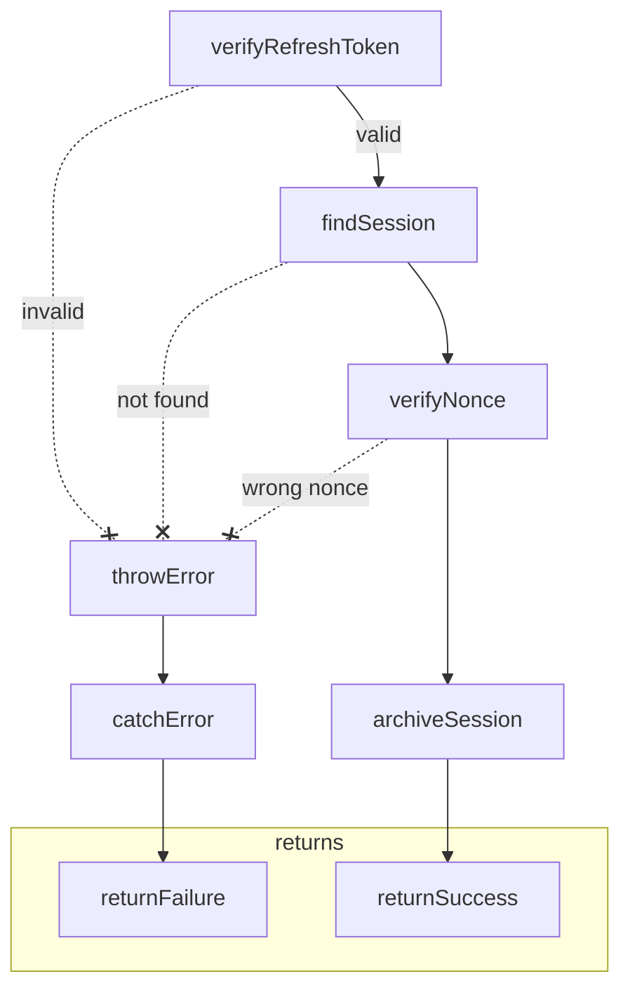
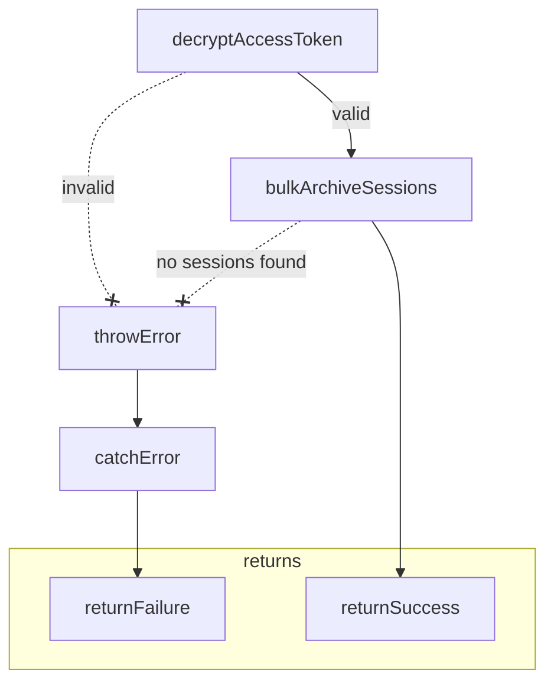

## Dependencies

- [**`jose`**](https://www.npmjs.com/package/jose)

  a standards-compliant JWT library that supports popular typescript runtimes

- [**`@node-rs/argon2`**](https://www.npmjs.com/package/@node-rs/argon2)

  a typescript binding for the [rust implementation](https://crates.io/crates/argon2) of the [Argon2](https://en.wikipedia.org/wiki/Argon2) hashing algorithm

```sh
npm i jose @node-rs/argon2
```

## Internals

```ts title="#/ops/auth/internals/access-token.ts"
import "server-only"; // <- if you are using react server components

import { EncryptJWT, jwtDecrypt } from "jose";
import {
  extractSecretPairs,
  generateSaltedKey,
  getKeyFromSecretsMap,
} from "./jwt-utils";

type AccessTokenCustomClaims = { userId: string };

/** The window of time that the access token will remain valid */
const ACCESS_TOKEN_EXPIRATION_MILLISECONDS = 15 * 60 * 1000; /** 15 minutes */

/** Set the algorithm for the JWE */
const alg = "dir";
/** Set the encoding for the JWE */
const enc = "A256GCM";

/** Load and transform the ACCESS_TOKEN_SECRETS environment variable */
const { secretsEntries, secretsMap } = extractSecretPairs({
  secretPairsList: process.env.ACCESS_TOKEN_SECRETS,
});

/**
 * Generates a JSON Web Encryption (JWE) token using the provided payload.
 * This implementation generates a unique salt per token that is stored in a custom `s` header.
 * Using a unique salt per token mitigates some risks of rainbow table attacks and limits exposure if the derived key is compromised
 */
export async function generateAccessToken({
  payload,
}: {
  payload: AccessTokenCustomClaims;
}) {
  const { kid, salt, key } = await generateSaltedKey({
    secretsEntries,
  });

  const exp = Date.now() + ACCESS_TOKEN_EXPIRATION_MILLISECONDS;

  return {
    token: await new EncryptJWT(payload)
      .setProtectedHeader({ alg, enc, kid, s: salt })
      .setExpirationTime(exp)
      .encrypt(key, { crit: { kid: true, s: true } }),
    exp,
  };
}

/** Decrypts a JWE token using {@link getKeyFromSecretsMap} and returns its payload. */
export async function extractAccessTokenPayload({
  token,
}: {
  token: Parameters<typeof jwtDecrypt>[0];
}) {
  const { payload } = await jwtDecrypt(
    token,
    getKeyFromSecretsMap({ secretsMap }),
    {
      keyManagementAlgorithms: [alg],
      contentEncryptionAlgorithms: [enc],
    },
  );
  return payload as AccessTokenCustomClaims & {
    exp: number;
  };
}
```

```ts title="#/ops/auth/internals/create-session.ts"
import { insertSession } from "#/models/sessions/queries";

import { generateNonce, generateRefreshToken } from "./refresh-token";

export async function createSession(
  {
    userId,
  }: {
    userId: string;
  },
  viaTx?: Parameters<typeof insertSession>[1],
) {
  const { nonce, nonceHash } = await generateNonce();

  const session = await insertSession({ userId, nonceHash }, viaTx);

  const { token: refreshToken } = await generateRefreshToken({
    session,
    nonce,
  });

  return { ...session, refreshToken };
}
```

```ts title="#/ops/auth/internals/hashing.ts"
import { hash, verify, type Options } from "@node-rs/argon2";

/**
 * Options based on OWASP recommendations
 * https://cheatsheetseries.owasp.org/cheatsheets/Password_Storage_Cheat_Sheet.html#argon2id
 * cross-reference https://tobtu.com/minimum-password-settings/
 */
const options: Options = {
  algorithm: 2, // Argon2id
  memoryCost: 32768, // 32 MiB <- Stronger than OWASP recs to account for stronger gpus now available
  timeCost: 2,
  outputLen: 32,
  parallelism: 1,
};

/** Transform given target into a hashed string using Argon2id */
export function hashTarget(target: Parameters<typeof hash>[0]) {
  return hash(target, options);
}

/** Verifies that a given hashed string and target match using Argon2id */
export function verifyTarget(
  hashed: Parameters<typeof verify>[0],
  target: Parameters<typeof verify>[1],
) {
  return verify(hashed, target, options);
}
```

```ts title="#/ops/auth/internals/jwt-utils.ts"
import { hkdf, randomBytes } from "node:crypto";

import { type JWTHeaderParameters } from "jose";

/** Transform a comma-separated list of id:secret pairs into a 2D key-value array and a Map for easy lookup */
export function extractSecretPairs({
  secretPairsList,
}: {
  secretPairsList: string | undefined;
}) {
  const secretPairs = secretPairsList?.split(",");
  if (!secretPairs?.length) throw new Error("secret must be set");

  const secretsEntries = secretPairs.map<[id: string, secret: string]>(
    (secretPair) => {
      const [id, secret] = secretPair.split(":");
      if (!id || !secret)
        throw new Error(
          "must be in 'id:secret' format with non-empty id and secret",
        );
      return [id, secret];
    },
  );

  return { secretsEntries, secretsMap: new Map(secretsEntries) };
}

/**
 * Derives an encryption key from the provided secret and salt.
 * Uses the HKDF function to ensure uniform randomness in the generated key, even if the secret is weak
 */
export function deriveHashKey({
  secret,
  salt,
}: {
  secret: Parameters<typeof hkdf>[1];
  salt: Parameters<typeof hkdf>[2];
}) {
  return new Promise((resolve: (value: Uint8Array) => void, reject) => {
    hkdf(
      "sha256",
      secret,
      salt,
      "Generated in wunshot",
      32,
      (err, derivedKey) => {
        if (err) reject(err);
        resolve(new Uint8Array(derivedKey));
      },
    );
  });
}

/** Generates a salt and uses {@link deriveHashKey} to generate a unique key */
export async function generateSaltedKey({
  secretsEntries,
}: {
  secretsEntries: [id: string, secret: string][];
}) {
  if (!secretsEntries[0]) throw new Error("secretEntries cannot be empty");

  const [kid, secret] = secretsEntries[0];
  const salt = randomBytes(32).toString("base64url");
  const key = await deriveHashKey({ secret, salt });

  return { kid, salt, key };
}

/**
 * Generates the decryption key by using the provided `kid` and `s` headers of a given JWT.
 * The `s` header is a custom one used for managing a unique salt per token.
 * Looks up the corresponding secret from the given secretsMap and uses HKDF to derive the key.
 */
export function getKeyFromSecretsMap({
  secretsMap,
}: {
  secretsMap: Map<string, string>;
}) {
  return function getKey({
    kid,
    s,
  }: JWTHeaderParameters & {
    s?: string;
  }) {
    if (!kid)
      throw new Error("`kid` claim is missing in the header parameters");
    if (!s) throw new Error("`s` claim is missing in the header parameters");

    const secret = secretsMap.get(kid);
    if (!secret) throw new Error("Cannot find decryption secret");

    return deriveHashKey({ secret, salt: s });
  };
}
```

```ts title="#/ops/auth/internals/refresh-token.ts"
import "server-only"; // <- if you are using react server components

import { randomBytes } from "node:crypto";

import { jwtVerify, SignJWT } from "jose";

import { type sessions } from "#/models/sessions/schemas";

import { hashTarget } from "./hashing";
import {
  extractSecretPairs,
  generateSaltedKey,
  getKeyFromSecretsMap,
} from "./jwt-utils";

/** Load and transform the REFRESH_TOKEN_SECRETS environment variable */
const { secretsEntries, secretsMap } = extractSecretPairs({
  secretPairsList: process.env.REFRESH_TOKEN_SECRETS,
});

/** Generates a cspr base64 url-encoded string and its hash */
export async function generateNonce() {
  const nonce = randomBytes(32).toString("base64url");
  return {
    nonce,
    nonceHash: await hashTarget(nonce),
  };
}

/**
 * Generates a JSON Web Signature (JWS) token with a random nonce.
 * This implementation generates a unique salt per token that is stored in a custom `s` header.
 * Using a unique salt per token mitigates some risks of rainbow table attacks and limits exposure if the derived key is compromised
 */
export async function generateRefreshToken({
  session: { id, expiresAt },
  nonce,
}: {
  session: Pick<typeof sessions.$inferSelect, "id" | "expiresAt">;
  nonce?: string;
}) {
  const { kid, salt, key } = await generateSaltedKey({
    secretsEntries,
  });

  const lazyNonce = nonce
    ? { nonce, nonceHash: undefined } // skip redundant hashing when nonce is passed in
    : await generateNonce();

  const token = await new SignJWT({ nonce: lazyNonce.nonce, sessionId: id })
    .setProtectedHeader({ alg: "HS256", kid, s: salt })
    .setExpirationTime(expiresAt)
    .sign(key, { crit: { kid: true, s: true } });

  return {
    token,
    nonceHash: lazyNonce.nonceHash,
  };
}

/** Verifies the signature of the given JWS token using {@link getKeyFromSecretsMap} and returns its payload */
export async function extractRefreshTokenPayload({ token }: { token: string }) {
  const { payload } = await jwtVerify(
    token,
    getKeyFromSecretsMap({ secretsMap }),
  );
  return payload as { exp: number; nonce: string; sessionId: string };
}
```

## Operations

### Sign Up (Create User)



```ts title="#/ops/auth/sign-up.ts"
import { flatten, safeParse } from "valibot";

import { db } from "#/index";
import { type OpsSafeReturn } from "#/helpers/types";
import { insertUser } from "#/models/users/queries";
import { UserFormInput } from "#/models/users/validations";

import { generateAccessToken } from "./internals/access-token";
import { createSession } from "./internals/create-session";
import { ActivityError, initializeLoggers } from "./internals/log-activity";

const ACTIVITY_LABEL = "SIGN_UP";

const failureCauses = {
  INVALID_CREDENTIAL: "INVALID_CREDENTIAL",
  USER_NOT_FOUND: "USER_NOT_FOUND",
  USER_ALREADY_EXISTS: "USER_ALREADY_EXISTS",
  PROBLEM_CREATING_SESSION: "PROBLEM_CREATING_SESSION",
} as const;

const failureOutputMessages = {
  GENERIC:
    "Something went wrong. Please ensure the information you entered is correct then try again",
  USER_ALREADY_EXISTS: "User already exists",
} as const;

/**
 * Create a new user and start an associated session.
 *
 * WARNING: The activitiesLog/rate-limiting mechanism has inherent attack vectors
 * An attacker could continuously submit credentials to hog db resources and drive up costs
 * If that becomes a problem, some solutions are:
 *   move the server behind a firewall/proxy
 *   add a (captcha) challenge for bot detection
 *   use a materialized view and/or store the results in a cache
 *   add more robust rate-limiting using in-memory storage
 */
export async function signUp({
  input,
}: {
  input: unknown;
}): Promise<OpsSafeReturn> {
  /** Apply a label for the activity to the logger */
  const { logSuccess, logFailure } = initializeLoggers({
    label: ACTIVITY_LABEL,
  });

  try {
    /** Validate the input */
    const {
      success: validationSuccess,
      output: validationOutput,
      issues: validationIssues,
    } = safeParse(UserFormInput, input);

    /**
     * If validation fails log the activity as a failure and return a generic error
     * It is likely a bad actor bypassing client-side validation
     */
    if (!validationSuccess)
      throw new ActivityError({
        activity: {
          failureCause: failureCauses.INVALID_CREDENTIAL,
        },
        message: failureOutputMessages.GENERIC,
      });

    /** @todo destructure necessary fields from the validation output based on the auth strategy */
    // const {} = validationOutput;

    /** Wrap the user creation & auth processes in a transaction */
    const {
      user: { id: userId },
      session: { refreshToken, expiresAt: sessionExpiresAt },
      access: { token: accessToken, exp: accessTokenExpiresAt },
    } = await db.transaction(async (tx) => {
      /**
       * Attempt to add a user
       * @todo modify arguments based on auth strategy
       */
      const user = await insertUser({}).catch((error) => {
        /**
         * If a user already exists with the given credential, return specified error
         * https://www.postgresql.org/docs/current/errcodes-appendix.html#ERRCODES-TABLE
         */
        if (error.code === "23505") {
          throw new ActivityError({
            activity: {
              failureCause: failureCauses.USER_ALREADY_EXISTS,
              failedCredential:
                credential /** @todo modify credential based on stategy */,
            },
            message: failureOutputMessages.USER_ALREADY_EXISTS,
          });
        }
        /** If any other error occurs, throw it to be caught by the outer try/catch {@link logFailure} as unknown */
        throw error;
      });

      const { id: userId } = user;

      /** Concurrently create a session and generate an access token */
      const [session, access] = await Promise.all([
        createSession({ userId }, { tx, label: "sign_up" }),
        generateAccessToken({ payload: { userId } }),
      ] as const);

      return { user, session, access };
    });

    /** Log the successful sign-up activity */
    await logSuccess({ userId });

    /** Return the user data and tokens */
    return {
      success: true,
      data: {
        userId,
        accessToken,
        accessTokenExpiresAt,
        refreshToken,
        sessionExpiresAt,
      },
    } as const;
  } catch (error) {
    await logFailure({ error });

    return {
      success: false,
      message:
        error instanceof ActivityError
          ? (error.message as (typeof failureOutputMessages)[keyof typeof failureOutputMessages])
          : failureOutputMessages.GENERIC,
    } as const;
  }
}
```

### Sign In



```ts title="#/ops/auth/sign-in.ts"
import { flatten, safeParse } from "valibot";

import { db } from "#/index";
import { type OpsSafeReturn } from "#/helpers/types";
import { UserFormInput } from "#/models/users/validations";
import { selectUserAndSessionsByUsername } from "#/models/sessions--users/queries";

import { generateAccessToken } from "./internals/access-token";
import { createSession } from "./internals/create-session";
import { verifyTarget } from "./internals/hashing";
import { ActivityError, initializeLoggers } from "./internals/log-activity";

const ACTIVITY_LABEL = "SIGN_IN";

const failureCauses = {
  INVALID_CREDENTIAL: "INVALID_CREDENTIAL",
  USER_NOT_FOUND: "USER_NOT_FOUND",
} as const;

const failureOutputMessages = {
  GENERIC:
    "Something went wrong. Please ensure the information you entered is correct then try again.",
} as const;

/**
 * Authenticate a user and start an associated session.
 *
 * WARNING: The activitiesLog/rate-limiting mechanism has inherent attack vectors
 * An attacker could continuously submit credentials to hog db resources and drive up costs
 * If that becomes a problem, some solutions are:
 *   move the server behind a firewall/proxy
 *   add a (captcha) challenge for bot detection
 *   use a materialized view and/or store the results in a cache
 *   add more robust rate-limiting using in-memory storage
 */
export async function signIn({
  input,
}: {
  input: unknown;
}): Promise<OpsSafeReturn> {
  /** Apply a label for the activity to the logger */
  const { logSuccess, logFailure } = initializeLoggers({
    label: ACTIVITY_LABEL,
  });

  try {
    /** Validate the input */
    const {
      success: validationSuccess,
      output: validationOutput,
      issues: validationIssues,
    } = safeParse(UserFormInput, input);

    /**
     * If validation fails log the activity as a failure and return a generic error
     * It is likely a bad actor bypassing client-side validation
     */
    if (!validationSuccess) {
      throw new ActivityError({
        activity: {
          failureCause: failureCauses.INVALID_CREDENTIAL,
        },
        message: failureOutputMessages.GENERIC,
      });
    }

    /** @todo destructure necessary fields from the validation output based on the auth strategy */
    // const {} = validationOutput;

    /** @todo Attempt to find the user for the given credentials based on the auth strategy */
    // const user = await selectUserByCredential({ credential });

    /** If no user is found, throw an error */
    if (!user) {
      throw new ActivityError({
        activity: {
          failureCause: failureCauses.USER_NOT_FOUND,
        },
        message: failureOutputMessages.GENERIC,
      });
    }

    const {
      id: userId,
      // ...
    } = user;

    /** @todo verify the input data matches the existing user data based on the auth strategy */

    /**
     * Create a payload reference for the access token.
     * This abstraction is unnecessary but creates a convenient place to add custom claims if needed
     */
    const payload = { userId };

    /** Wrap the auth processes in a transaction */
    const {
      session: { refreshToken, expiresAt: sessionExpiresAt },
      access: { token: accessToken, exp: accessTokenExpiresAt },
    } = await db.transaction(async (tx) => {
      /** Concurrently create a session and generate an access token */
      const [session, access] = await Promise.all([
        createSession({ userId }, { tx, label: "sign_in" }),
        generateAccessToken({ payload }),
      ] as const);

      return { session, access };
    });

    /** Log the successful sign-in activity */
    await logSuccess({ userId });

    /** Return the user data and tokens */
    return {
      success: true,
      data: {
        ...payload,
        accessToken,
        accessTokenExpiresAt,
        refreshToken,
        sessionExpiresAt,
      },
    } as const;
  } catch (error) {
    /** Handle thrown errors by sending them to the activitiesLog */
    await logFailure({ error });

    /** Return the status and an error message */
    return {
      success: false,
      message:
        error instanceof ActivityError
          ? (error.message as (typeof failureOutputMessages)[keyof typeof failureOutputMessages])
          : failureOutputMessages.GENERIC,
    } as const;
  }
}
```

### Verify Access



```ts title="#/ops/auth/verify-access.ts"
import { serializeError } from "serialize-error";

import { type OpsSafeReturn } from "#/helpers/types";

import { ActivityError, initializeLoggers } from "./internals/log-activity";
import { extractAccessTokenPayload } from "./internals/access-token";

const ACTIVITY_LABEL = "VERIFY_ACCESS";

const failureCauses = {
  INVALID_JWE: "INVALID_JWE",
} as const;

const failureOutputMessages = {
  GENERIC:
    "Authentication failure. Please ensure you are signed in and try again.",
} as const;

/**
 * Verify an access token and return data from its payload
 * Logging success is disabled by default to avoid using any database connections
 */
export async function verifyAccess({
  token,
  logOnSuccess = false,
}: {
  token: string;
  logOnSuccess?: boolean;
}): Promise<OpsSafeReturn> {
  /** Apply a label for the activity to the logger */
  const { logSuccess, logFailure } = initializeLoggers({
    label: ACTIVITY_LABEL,
  });

  try {
    // eslint-disable-next-line @typescript-eslint/no-unused-vars
    const { exp, ...filteredPayload } = await extractAccessTokenPayload({
      token,
    }).catch((error) => {
      // eslint-disable-next-line @typescript-eslint/no-unused-vars
      const { stack, ...errorProps } = serializeError(error);
      throw new ActivityError({
        activity: {
          failureCause: failureCauses.INVALID_JWE,
          meta: errorProps,
        },
        message: failureOutputMessages.GENERIC,
      });
    });

    if (logOnSuccess) await logSuccess({ userId: filteredPayload.userId });

    /** Return the relevant data directly from the payload */
    return { success: true, data: filteredPayload } as const;
  } catch (error) {
    /** Handle thrown errors by sending them to the activitiesLog */
    await logFailure({ error });

    /** Return the status and an error message */
    return {
      success: false,
      message:
        error instanceof ActivityError
          ? (error.message as (typeof failureOutputMessages)[keyof typeof failureOutputMessages])
          : failureOutputMessages.GENERIC,
    } as const;
  }
}
```

### Refresh



```ts title="#/ops/auth/refresh-auth.ts"
import { serializeError } from "serialize-error";

import { db } from "#/index";

import {
  selectSession,
  updateSessionNonceHash,
} from "#/models/sessions/queries";

import {
  extractRefreshTokenPayload,
  generateRefreshToken,
} from "./internals/refresh-token";
import { verifyTarget } from "./internals/hashing";
import { ActivityError, initializeLoggers } from "./internals/log-activity";
import { generateAccessToken } from "./internals/access-token";

const ACTIVITY_LABEL = "REFRESH_AUTH";

const failureCauses = {
  INVALID_JWS: "INVALID_JWS",
  SESSION_NOT_FOUND: "SESSION_NOT_FOUND",
  WRONG_NONCE: "WRONG_NONCE",
  EMPTY_SESSION_UPDATE: "EMPTY_SESSION_UPDATE",
} as const;

const failureOutputMessages = {
  GENERIC:
    "Authentication failure. Please ensure you are signed in and try again.",
} as const;

export async function refreshAuth({ token }: { token: string }) {
  /** Apply a label for the activity to the logger */
  const { logSuccess, logFailure } = initializeLoggers({
    label: ACTIVITY_LABEL,
  });

  try {
    const { nonce, sessionId } = await extractRefreshTokenPayload({
      token,
    }).catch((error) => {
      // eslint-disable-next-line @typescript-eslint/no-unused-vars
      const { stack, ...errorProps } = serializeError(error);
      throw new ActivityError({
        activity: {
          failureCause: failureCauses.INVALID_JWS,
          meta: errorProps,
        },
        message: failureOutputMessages.GENERIC,
      });
    });

    /** Find the session by id */
    const session = await selectSession({ id: sessionId });

    /** If the session is not found, throw an associated error */
    if (!session)
      throw new ActivityError({
        activity: {
          failureCause: failureCauses.SESSION_NOT_FOUND,
          meta: { sessionId },
        },
        message: failureOutputMessages.GENERIC,
      });

    const { nonceHash, expiresAt } = session;

    /** Ensure the refresh token matches the hashed one stored in the database */
    const isNonceVerified = await verifyTarget(nonceHash, nonce);

    /** If the refresh token doesn't match, throw an associated error */
    if (!isNonceVerified)
      throw new ActivityError({
        activity: {
          failureCause: failureCauses.WRONG_NONCE,
        },
        message: failureOutputMessages.GENERIC,
      });

    /** Create a new refresh token and its hash */
    const { token: newRefreshToken, nonceHash: newNonceHash } =
      await generateRefreshToken({ session: { id: sessionId, expiresAt } });

    /** Wrap the auth processes in a transaction */
    const {
      updatedSession: { userId, expiresAt: sessionExpiresAt },
      access: { token: newAccessToken, exp: accessTokenExpiresAt },
    } = await db.transaction(async (tx) => {
      /** Update the existing session's refresh token hash and expiration date */
      const updatedSession = await updateSessionNonceHash(
        {
          id: sessionId,
          nonceHash: newNonceHash!,
        },
        { tx, label: "refresh_auth" },
      );

      /**
       * An update can return an empty array without throwing an error
       * this will catch that and rollback the transaction
       */
      if (!updatedSession)
        throw new ActivityError({
          activity: {
            failureCause: failureCauses.EMPTY_SESSION_UPDATE,
            meta: { sessionId },
          },
          message: failureOutputMessages.GENERIC,
        });

      /** Create a new encrypted JWT access token */
      const access = await generateAccessToken({
        payload: { userId: updatedSession.userId },
      });

      return { updatedSession, access };
    });

    /** Log the successful activity */
    await logSuccess({ userId });

    /** Return the data that's embedded in the JWE as well as data needed to create cookies for refreshing auth */
    return {
      success: true,
      data: {
        userId,
        newAccessToken,
        accessTokenExpiresAt,
        newRefreshToken,
        sessionExpiresAt,
      },
    } as const;
  } catch (error) {
    /** Handle thrown errors by sending them to the activitiesLog */
    await logFailure({ error });

    /** Return the status and an error message */
    return {
      success: false,
      message:
        error instanceof ActivityError
          ? (error.message as (typeof failureOutputMessages)[keyof typeof failureOutputMessages])
          : failureOutputMessages.GENERIC,
    } as const;
  }
}
```

### Sign Out



```ts title="#/ops/auth/sign-out.ts"
import { serializeError } from "serialize-error";

import { type OpsSafeReturn } from "#/helpers/types";
import { archiveSession } from "#/models/sessions/cascades";
import { selectSession } from "#/models/sessions/queries";

import { verifyTarget } from "./internals/hashing";
import { ActivityError, initializeLoggers } from "./internals/log-activity";
import { extractRefreshTokenPayload } from "./internals/refresh-token";

const ACTIVITY_LABEL = "SIGN_OUT";

const failureCauses = {
  INVALID_JWS: "INVALID_JWS",
  SESSION_NOT_FOUND: "SESSION_NOT_FOUND",
  SESSION_EXPIRED: "SESSION_EXPIRED",
  WRONG_NONCE: "WRONG_NONCE",
} as const;

const failureOutputMessages = {
  GENERIC: "Something went wrong.",
} as const;

/**
 * Remove session and add it to sessionsArchive
 *
 * Checks if the user has a valid session/refresh token first to ensure
 * that an attacker can not arbitrarily remove random sessions
 */
export async function signOut({
  token,
}: {
  token: string;
}): Promise<OpsSafeReturn> {
  /** Apply a label for the activity to the logger */
  const { logSuccess, logFailure } = logActivity({
    label: ACTIVITY_LABEL,
  });

  try {
    const { nonce, sessionId } = await extractRefreshTokenPayload({
      token,
    }).catch((error) => {
      // eslint-disable-next-line @typescript-eslint/no-unused-vars
      const { stack, ...errorProps } = serializeError(error);
      throw new ActivityError({
        activity: {
          failureCause: failureCauses.INVALID_JWS,
          meta: errorProps,
        },
        message: failureOutputMessages.GENERIC,
      });
    });

    /** Find the session by id */
    const session = await selectSession({ id: sessionId });

    /** If the session is not found, throw an associated error */
    if (!session)
      throw new ActivityError({
        activity: {
          failureCause: failureCauses.SESSION_NOT_FOUND,
          meta: { sessionId },
        },
        message: failureOutputMessages.GENERIC,
      });

    const { nonceHash, userId } = session;

    /**
     * Ensure the refresh token matches the hashed one stored in the database
     * @todo consider removing this check. It was written before the refreshToken was a signed JWT and may no longer be necessary
     */
    const isNonceVerified = await verifyTarget(nonceHash, nonce);

    /** If the refresh token doesn't match, throw an associated error */
    if (!isNonceVerified)
      throw new ActivityError({
        activity: {
          failureCause: failureCauses.WRONG_NONCE,
        },
        message: failureOutputMessages.GENERIC,
      });

    /** Delete the session */
    await archiveSession({ id: sessionId });

    /** Log the successful activity */
    await logSuccess({ userId });

    /** Return success and an empty data object */
    return {
      success: true,
      data: {},
    } as const;
  } catch (error) {
    /** Handle thrown errors by sending them to the activitiesLog */
    await logFailure({ error });

    /** Return the status and an error message */
    return {
      success: false,
      message:
        error instanceof ActivityError
          ? (error.message as (typeof failureOutputMessages)[keyof typeof failureOutputMessages])
          : failureOutputMessages.GENERIC,
    } as const;
  }
}
```

### Sign Out All



```ts title="#/ops/auth/sign-out-all.ts"
import { serializeError } from "serialize-error";

import { type OpsSafeReturn } from "#/helpers/types";
import {
  bulkArchiveSessionsByUserId,
  NO_SESSIONS_FOUND,
} from "#/models/sessions/cascades";

import { ActivityError, logActivity } from "./internals/log-activity";
import { extractAccessTokenPayload } from "./internals/access-token";

const ACTIVITY_LABEL = "SIGN_OUT_ALL";

const failureCauses = {
  RATELIMIT: "RATELIMIT",
  INVALID_JWE: "INVALID_JWE",
  NO_SESSIONS_FOUND: "NO_SESSIONS_FOUND",
} as const;

const failureOutputMessages = {
  GENERIC: "Something went wrong.",
} as const;

/**
 * Remove all sessions for a user based on the given accessToken. Used to sign-out on all devices.
 */
export async function signOutAll({
  input,
}: {
  input: { accessToken: string };
}): Promise<OpsSafeReturn> {
  /** Apply a label for the activity to the logger */
  const { logSuccess, logFailure } = logActivity({
    label: ACTIVITY_LABEL,
  });

  try {
    /** Validate access token and get user id */
    // eslint-disable-next-line @typescript-eslint/no-unused-vars
    const { exp, userId } = await extractAccessTokenPayload({
      token: input.accessToken,
    }).catch((error) => {
      // eslint-disable-next-line @typescript-eslint/no-unused-vars
      const { stack, ...errorProps } = serializeError(error);
      throw new ActivityError({
        activity: {
          failureCause: failureCauses.INVALID_JWE,
          meta: errorProps,
        },
        message: failureOutputMessages.GENERIC,
      });
    });

    await bulkArchiveSessionsByUserId({ userId }).catch((error) => {
      /** Throw an ActivityError if no sessions are found */
      if (error.message === NO_SESSIONS_FOUND)
        throw new ActivityError({
          activity: {
            failureCause: failureCauses.NO_SESSIONS_FOUND,
            userId,
          },
          message: failureOutputMessages.GENERIC,
        });
      /** If any other error occurs, throw it to be caught by the outer try/catch {@link logFailure} as unknown */
      throw error;
    });

    /** Log the successful activity */
    await logSuccess({ userId });

    /** Return success and an empty data object */
    return {
      success: true,
      data: {},
    } as const;
  } catch (error) {
    /** Handle thrown errors by sending them to the activitiesLog */
    await logFailure({ error });

    /** Return the status and an error message */
    return {
      success: false,
      message:
        error instanceof ActivityError
          ? (error.message as (typeof failureOutputMessages)[keyof typeof failureOutputMessages])
          : failureOutputMessages.GENERIC,
    } as const;
  }
}
```
