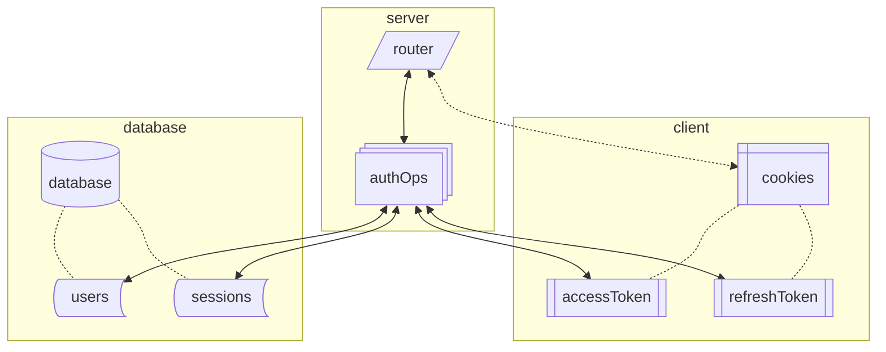
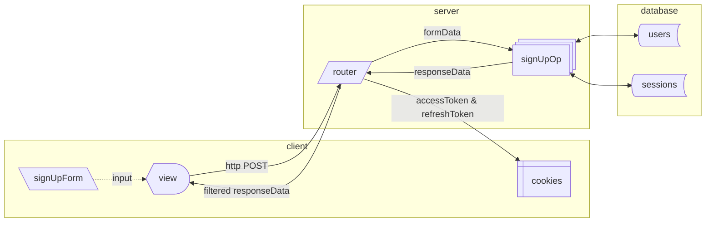
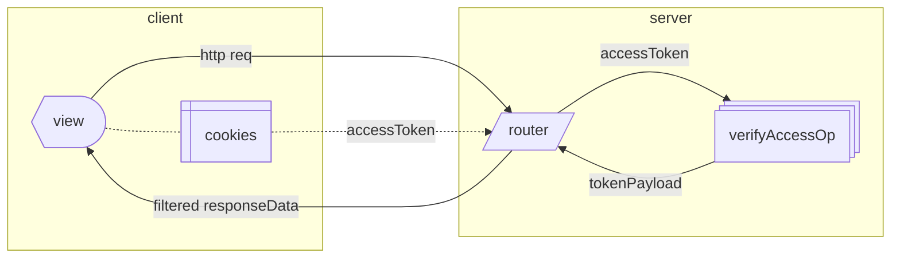
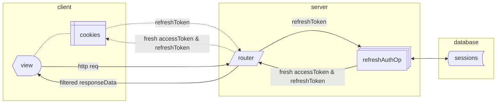
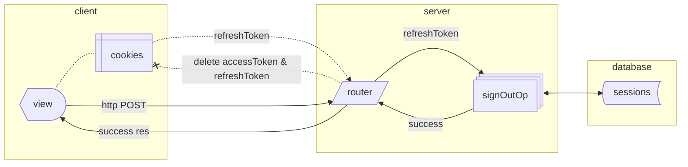
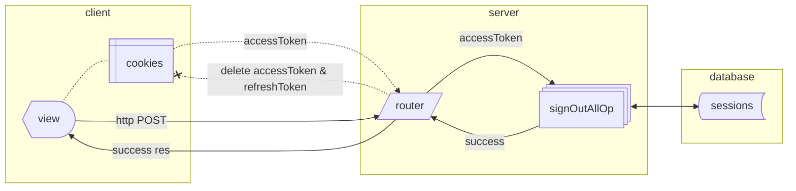

The auth modules utilize a combination of JWTs and a `sessions` table to manage user authentication state.

This approach provides a high level of security while minimizing roundtrips to the database.



## Fundamentals of Auth

### What Is a Session?

A session maintains a user’s authentication state between uses of your web app.

In wunshot, sessions are generally associated with a device and browser. By default, a user can have multiple sessions and each browser that a user signs in with will create a new session.

> _Technically a session can be moved between devices and browsers if the token cookies are moved, but that is an edge case_

Sessions in wunshot are stored in the database. [Read more about the methodology below](#why-use-a-database).

#### Schema

| Column       | Type         | Description                                                          |
| ------------ | ------------ | -------------------------------------------------------------------- |
| `id`         | `uuid`       | Primary Key                                                          |
| `user_id`    | `uuid`       | Foreign Key for users table `id`                                     |
| `nonce_hash` | `text`       | [Hashed random value used for verification](#nonces) |
| `expires_at` | `timestampz` | When the session expires                                             |
| ...          | ...          | Other standard columns like `created_at`, `updated_at`, etc.         |

### What Is an `accessToken`?

An `accessToken` is a short-lived token that grants access to a user's resources.
It acts as a proof that the user has authenticated within the expiration window.

In wunshot, [the `accessToken` is an encrypted JWT](#why-use-jwts).
When the server receives an `accessToken` it uses a secret key to decrypt and validate the token.

If that decryption and validation is successful, it means the token has not expired and has not been tampered with.

Since [the token is stored in a Secure SameSite HttpOnly cookie](#why-use-cookies), there is reasonable assurance that the request is coming from the user that the token was issued to.

Applications should require a valid `accessToken` on protected actions and operations to provide a reasonable amount of security.

---

If the `accessToken` _is_ stolen and submitted by an attacker, it is a security breach.
[There is no mechanism to revoke an `accessToken`](#disadvantages).

To reduce that risk, the token has a short expiration (15 minutes by default) that limits the time an attacker has to submit the token.

#### As a Cache

The token itself can also be used as a cache of authenticated user data.

In wunshot, this is the shape of the payload:

```ts
{
  userId: "SOME-UUID";
}
```

More data can be added to the payload according to your app’s needs.

The JWT is encrypted as a JWE, so the payload is _obfuscated_. **That does not make it suitable for storing sensitive information.** If a bad actor somehow gets access to the token, then the encryption could be broken given enough time.

It does make it suitable for storing information that would not be harmful if leaked.
The user’s `id` is a good example.
Ideally it would remain secret, but there is little an attacker could do with the information if the rest of the app is secure.

In the case of public user info, like a `username`, the payload can be used as a cache but localstorage may be more appropriate.

Ultimately, you will need to make a judgement call about what belongs in the `accessToken` payload.

### What Is a `refreshToken`?

The `refreshToken` is used to verify the session after the `accessToken` expires without requiring the user to sign in.

In wunshot, the `accessToken` is a JWT with this payload:

```ts
{
  nonce: 'base64url-encoded-random-string',
  sessionId: 'SOME-UUID'
}
```

Both of those fields are randomly generated, so the chances that an attacker could guess a matching pair is infinitesimally small.

The JWT is signed to ensure authenticity at integrity of the data.

#### Nonces

The `nonce` acts like a single-use "password" to the session.
A hashed version of the `nonce` is stored in the sessions table.

When a refresh request comes in, the value of the `nonce` from the `refreshToken` is verified against the stored `nonce_hash` column.

The existing `nonce` should be replaced with a newly generated one after every successful verification.

Hashing the values prevents an attacker from being able to hijack any users if the `sessions` table is leaked.

The `nonce` also adds an extra layer of security to prevent attacks where guessing the `sessionId` could result in a breach.
For example, if the `sign-out` function checked the `sessionId` field without verifying other data, an attacker could run a DDOS by brute-forcing randomly generated uuids as the `sessionId` and continually calling the method.

> _In that example, the JWT signature would also have to have been cracked. But security is like an onion. **Layers**. Onions have layers. Security has layers. Onions have layers. You get it. They both have layers._

### Why Use Cookies?

Cookies are the only form of persistent client-side storage that offer a way to prevent direct access via JavaScript.

#### Client-Side Storage

Storing some authentication data on the client allows a user to **stay signed-in** in their browser.

It also allows you to use that data as a cache.
That means **you can skip some requests to the database and save yourself some potential time and network costs**.

#### Security

The [HttpOnly](https://developer.mozilla.org/en-US/docs/Web/HTTP/Reference/Headers/Set-Cookie#httponly) attribute forbids JavaScript from accessing cookie, mitigating [some cross-site-scripting (XSS) attacks](https://cheatsheetseries.owasp.org/cheatsheets/Cross_Site_Scripting_Prevention_Cheat_Sheet.html#other-controls).

The [Secure](https://developer.mozilla.org/en-US/docs/Web/HTTP/Reference/Headers/Set-Cookie#secure) attribute [protects against man-in-the-middle (MITM) attacks](https://cheatsheetseries.owasp.org/cheatsheets/Session_Management_Cheat_Sheet.html#secure-attribute) by only allowing transport over https.

And the [SameSite](https://developer.mozilla.org/en-US/docs/Web/HTTP/Reference/Headers/Set-Cookie#samesitesamesite-value) attribute can [help prevent cross-site request forgery (CSRF) attacks](https://cheatsheetseries.owasp.org/cheatsheets/Cross-Site_Request_Forgery_Prevention_Cheat_Sheet.html#samesite-cookie-attribute).

No other form of client-side storage offers those protections.

#### Disadvantages

Skipping the database means that **the stored data is implicitly trusted**.
Once the data is stored on the client, **there’s no mechanism to revoke it**.
Any attempt to do so would require a trip to the database, defeating one of the benefits of the client-side storage in the first place.
[There is a way to invalidate all tokens](#emergency-invalidation), but it should only be used as a last resort.

Cookies are **limited to about 4kb of data** per cookie.
Storing more than that limit requires advanced strategies to compress the data or split it between cookies.

Cookies are sent with every request.
As the amount of data stored in the cookies increases, so does the bandwidth required to use your app.
So over-reliance on cookies **can result in a slower app**.

### Why use JWTs?

A [JSON Web Token (JWT)](https://jwt.io/introduction) is store of JSON data that can be signed with a secret key.

There are straightforward methods for implementing signatures and encryption.

**Signatures are useful for ensuring that data received has not been tampered with**.
In other words, when a JWT validates successfully, the data within can be trusted as coming from an authorized source.

**Encryption is useful for keeping data confidential** in addition to ensuring its integrity and authenticity.

Over enough time, the encryption can be broken, so it is not recommended for anything too sensitive.
But it’s good enough for obfuscating data in the short-term and increasing the work required to crack.

In wunshot, there is a single source and recipient so only symmetric keys are used.
Symmetric keys are generally fast and comparatively simple to implement.

---

The main benefit of JWTs over other protocols is its wide adoption.
The `jose` library provides a standard set of functions and is used by many popular auth libraries.

Other options such as [PASETO](https://paseto.io/) may fill this role in the future.

#### Secret Rotation

Secrets in wunshot use a combination of salting and hash-key derivation to keep secrets safe.
That said, it is best practice to rotate secrets regularly to prevent unauthorized access.

The signing functions in wunshot expect secrets to be in the format of:
```ini
TOKEN_SECRETS=`{id1}:{secret1},{id2}:{secret2},{id3}:{secret3}`
```

It is a comma separated list of `id:secret` pairs where `id` is a unique identifier (probably a UUIDv4) for the secret and `secret` is the actual secret value.

Using a random id is recommended for a convenient way to prevent collisions without leaking any information about when the secret was generated.

##### Emergency Invalidation

Roatating secrets provides an opportunity to invalidate all tokens for a given secret.

If you erase all of the existing secret pairs that a token uses then any tokens "in the wild" with old secrets will fail to validate.

While not useful for a targeted attack, it could be used if an exploit affects multiple users.

##### Implementation

There is no explicit secret management or time limit implementation within wunshot.

Here are some example functions you can use:
```ts
export function generateSecretPair() {
  return `${crypto.randomUUID()}:${crypto
    .randomBytes(32)
    .toString("base64url")}`;
}

export function rotateSecrets(existingSecrets?: string) {
  if (!existingSecrets)
    return `${generateSecretPair()},${generateSecretPair()},${generateSecretPair()}`;
  return existingSecrets
    .split(",")
    .slice(0, -1)
    .splice(0, 0, generateSecretPair())
    .toString();
}
```

But you are expected to manage how those functions (or something similar) work within your app ecosystem.

### Why Use a Database?

Storing auth data in a database is a tried and tested method for session management.

**Any time the database is checked, the session can be validated or revoked**.

Revoking a session can be a useful tool for mitigating targeted attacks.
For example, if a user reports a phishing attempt then all the sessions associated with that user can be archived and any existing `refreshToken` will fail.

The disadvantage of database auth is that it requires a roundtrip to the database.
So it can be slower, expensive, and hard to scale connections as the amount of users grows.

### Putting it All Together

The auth module of wunshot maximizes efficiency without sacrificing security by using a hybrid approach of cookie and database session management.

Access tokens and refresh tokens are stored as JWTs in cookies to keep users signed-in on their browsers.

The database is used to validate refreshes and to provide a mechanism for revoking access when needed.

## Auth Lifecycle

### Sign Up (Create User)



When a user signs up, new rows are added to the `users` and `sessions` tables and an `accessToken` and `refreshToken` are generated.

The new user data and tokens are returned to the router.

The router should then store the tokens in cookies and send any pertinent info to the view. (This part should be done within your frontend framework)

### Sign In


Signing in uses mostly the same flow as signing up, but retrieves an existing `users` row instead of adding a new one.

A new `accessToken` and `refreshToken` are generated for the new session and returned with the user data.

The router should then store the tokens in cookies and send any pertinent info to the view. (This part should be done within your frontend framework)

### Verify Access



The `accessToken` can be used as proof that the user has authenticated.
Once it is successfully decoded and validated, the user can be trusted to access the requested resource.

Notably, **this process does not use a database connection**. It also does not generate a new session or token.

The extracted payload data is returned to the router.

No cookies should be set or changed by this operation.

### Refresh



Refreshing is done with the `refreshToken` after the `accessToken` expires.

The token is sent with a request and passes through multiple stages of validation.
Then a fresh `refreshToken` and `accessToken` token are generated and the session is updated with a new `nonce_hash`. 

The tokens and fields from the `accessToken` payload are returned to the router.

The router should then store the tokens in cookies and send any pertinent info to the view. (This part should be done within your frontend framework)

### Sign Out



Signing out archives the session in the database.

Notably, the `refreshToken` is used instead of the `accessToken` for this functionality.
That’s because the data in `refreshToken` payload already has all the session information necessary to complete the operation.
It also means that signing out can be done after the `accessToken` has expired.

A success returns an empty data object.

The router should delete the tokens from cookies. (This part should be done within your frontend framework)

### Sign Out All



Sign out all will archive all the sessions associated with a user.

It functions similarly to Sign Out, but uses the `accessToken` payload to provide the `userId`.

A success returns an empty data object.

The router should delete the tokens from cookies. (This part should be done within your frontend framework)

{/* ## Protecting Actions */}
