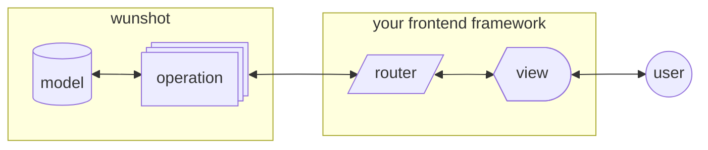
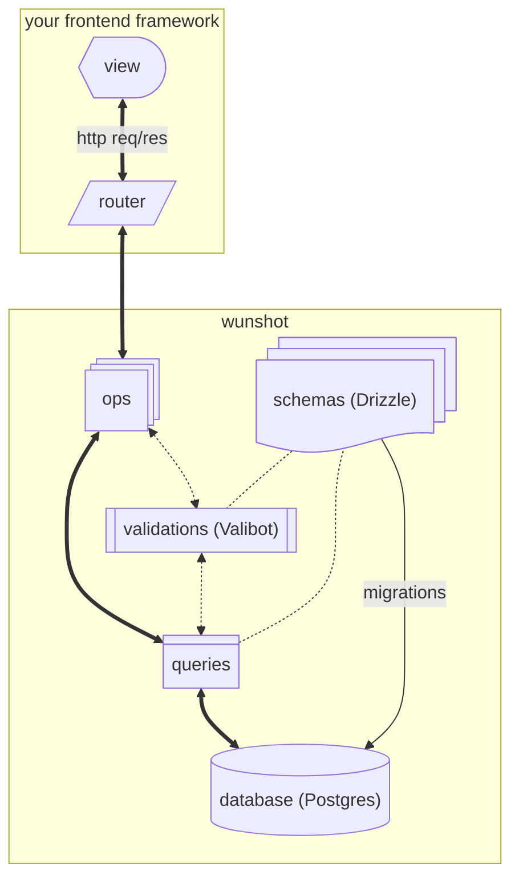
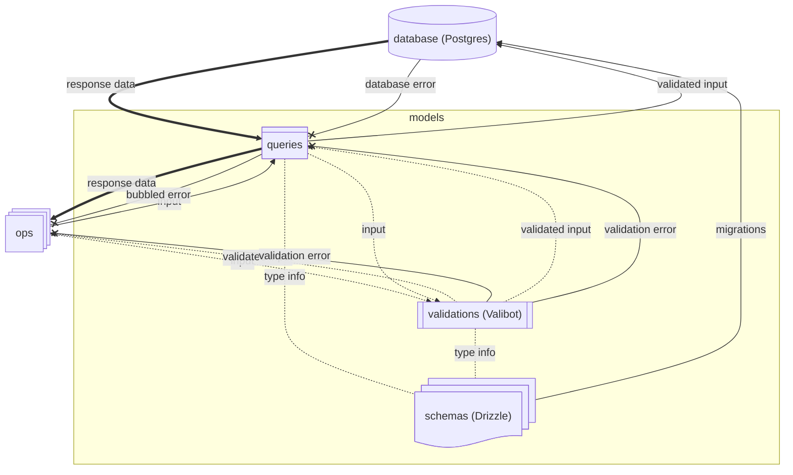
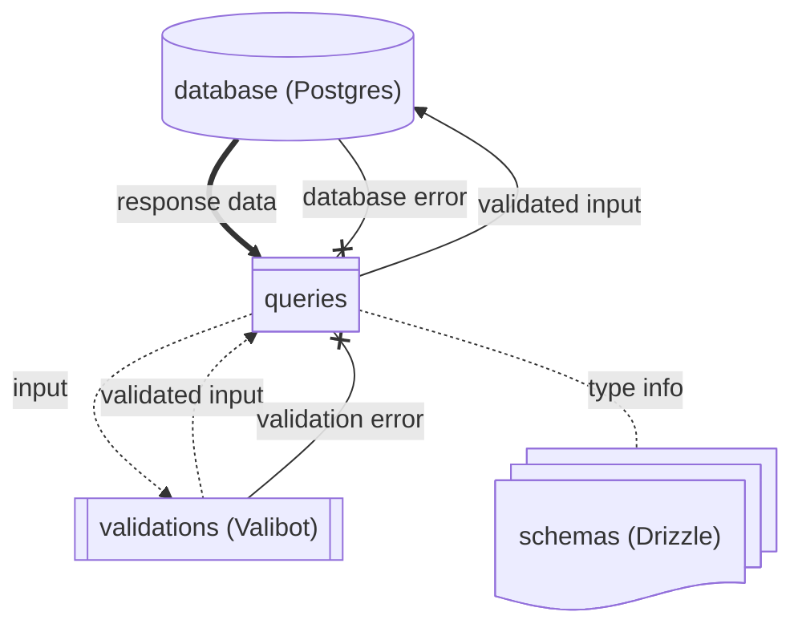
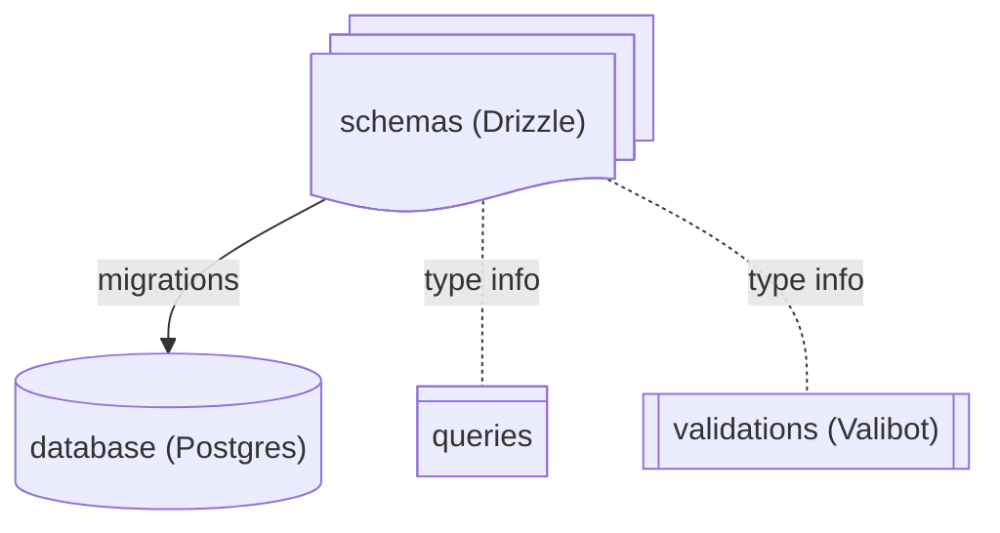
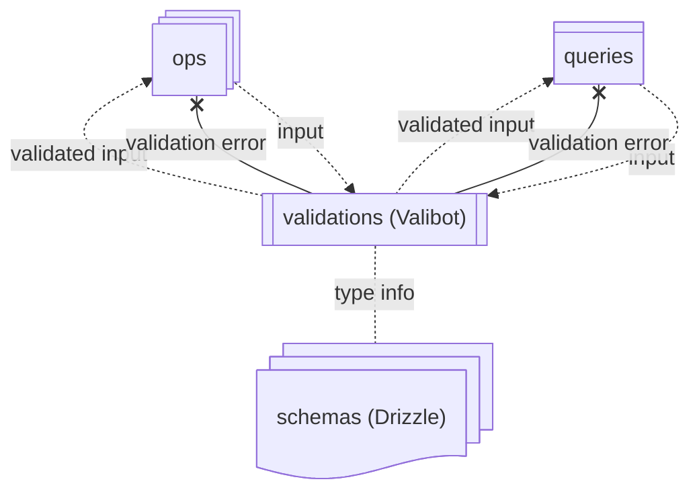
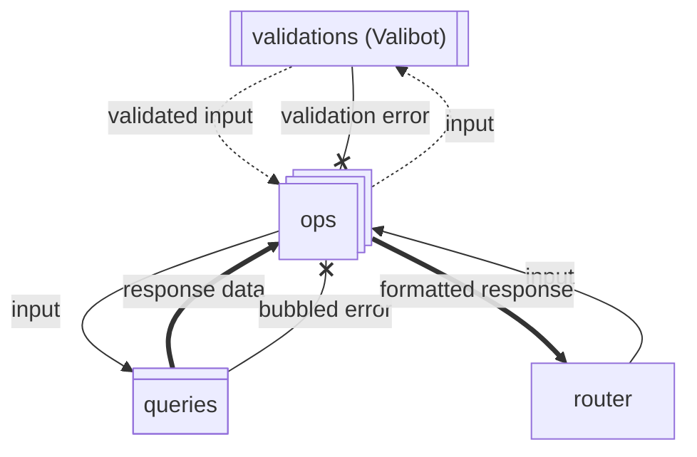

import { FileTree } from "@astrojs/starlight/components";

> _Conventions, methodology, paradigms, fundamentals, axioms, etc._
>
> _Learn how to do things "the wunshot way."_

Most of this can be learned through simply using a few wunshot modules. If you’re a hands-on learner feel free to skip ahead.

## Goals

The focus of wunshot is providing new projects with everything they need to handle their first users.

It’s a "ship first, scale later" mentality to help you go from 0 to startup (or side-project) in record time.

#### Easy to Start

Writing code should feel liberating, not burdensome. Developers are most free when they don’t need to think about how to structure the codebase and can focus on features.

#### Easy to Learn

Code should be well organized, readable, and repeatable. When a new developer joins the project, they should be able to contribute as quickly as possible.

#### Easy to Eject

Lock-in is not a good moat. If your project deviates from wunshot, removing it should be frictionless.

## Architectural Overview

### MORV

At the highest level, wunshot is a riff on the traditional [Model-View-Controller (MVC)](https://en.wikipedia.org/wiki/Model%E2%80%93view%E2%80%93controller) pattern with some opinionated refinements.

The major difference is that it splits the responsibilities of a traditional controller into two distinct top-level layers: **Operation** and **Router**.

I call it the **MORV** pattern for short.

**Model**: the data access layer - responsible for database migrations, connections, and queries

**Operation**: the service layer - responsible for application/business logic, composing queries, formatting response data, and handling errors

**Router**: the HTTP processing layer - responsible for connecting views to operations and handling cookies and redirects as needed

**View**: the presentation layer - responsible for content, styling, and user interaction

Splitting the controller this way allows wunshot to remain frontend agnostic.
Operations are firmly within the domain of wunshot and the Router is explicitly outside of it.
It makes answering "where should this logic go?" much simpler.



### Data Flow

The MORV Operation and Model break down into more granular pieces like this:



#### View

Generally, data comes from a user interaction.

Most of the time, it manifests in the form of an HTTP request.

#### Router

Code on the frontend server reads the request and then calls the appropriate operation.

#### Operation

Input data passes into an initial validation step and then query functions are called.

#### Model

Query functions call their own validations and run SQL on the database.

#### Return

The database returns row information to the query function called from the Operation.

The Operation formats the data for consumption by the Router/View.

#### Errors

Invalid data or problems querying the database will cause errors.

**By convention, errors are always handled by the Operation layer.**

That means that you don't need to write individual catch statements at every level.

If you do catch an error early, make sure to bubble it up so the Operation can capture it.

### Data Structure

The organization of data in **wunshot prioritizes modularity** over most other concerns.
The model **schemas are designed to be as self-contained as is reasonable**.

Sometimes that means arrays are used as a column data type.

Sometimes it means schemas use denormalized data.

Application flexibility is preferred over database rigidity.
**Most changes to application logic should not require running a database migration.**

As a result, `text` is often preferred over `varchar(n)` or `enum`.

An `enum` may still be the best choice in cases where values are not expected to be added over time.

{/* For instances where data integrity is crucial, `text` columns with check constraints are preferred over `varchar(n)` */}

#### Check Constraints

A check contraint provides a test that values must pass before being placed in the database.

That adds an additional layer of data integrity to the column, but also require a migration to update. When the constraint is updated, all existing rows must also pass the new test.

When data integrity is paramount and you do not expect the requirements to change often, then enabling check constraints is a good choice.

`text` columns with check constraints are preferred over `varchar(n)` since they offer more flexibility and negligible difference in performance.

---

**Most modules in wunshot will not use check constraints by default.**

**Using valibot schemas as the single source of truth for validation is often a more simple, flexible, and maintainable approach to data integrity.**

The boost that check constraints provide is not worth the added complexity in most cases.

#### Soft Deletes and Archive Tables

By convention, wunshot supports "soft deletes" through archive tables to ensure data integrity.

**Benefits:**

- **Reliable Foreign Key Enforcement:**

  Relations can be managed explicitly by foreign keys and thus enforced at the database layer instead of the ORM layer

- **Cleaner Queries:**

  Queries don't need to filter with `is_deleted = false`

- **Distinct Data State:**

  Data is clear, consistent, and easy to reason about

**Tradeoffs:**

- **Increased schema complexity:**

  Most related tables will require foreign key columns referencing both the "live" table (e.g., userId) and the corresponding archive table (e.g., usersArchiveId)

- **Migration Overhead:**

  When a table schema is updated, the archive table will also need to update and run a migration

- **Performance Costs:**

  Archiving an item requires at least one delete and one insert plus updates for each foreign key relation and a transaction to wrap it all

To address those disadvantages, wunshot handles most of the upfront schema complexity for you and [drizzle-kit keeps the migrations manageable](https://orm.drizzle.team/docs/migrations).

The performance of archiving is slower than updating a `is_deleted` column, but the reality is apps don’t need great performance for archiving --
the bottleneck for your app is probably not going to be that you can’t delete rows fast enough.

Handling foreign key updates may be annoying, but I would rather have a structure that forces me to consider the impact of removing a row than one that allows data inconsistencies to fester.

##### Example

Let’s say you have a `users` table and an `orders` table.

- The `orders` table uses a `user_id` column as a foreign key.
- When a user is deleted, pending orders should be canceled.
- There’s one developer responsible for users and another developer focused on order management.

In a traditional soft delete approach, the developer responsible for users creates a `deleteUser` function that updates an `is_deleted` column in the `users` table.
The database accepts the query and continues on.
But, the orders table now references a deleted user.
The application continues to run smoothly, but a month later a disgruntled customer issues a chargeback.

With an archive table, while the developer is writing the `deleteUser` function they get a foreign key restraint error because `user_id` needs to be set to `null` in the `orders` table before the database will accept the delete.
This forces the user developer to reach out to the order management developer to ensure that the function handles the needs of both teams.

Both approaches ultimately rely on the developers knowing and implementing the correct business logic.
An archive table will prevent an arbitrary user deletion, but there’s nothing about that constraint that makes the developer aware that the status of an order should also change.
There’s no perfect solution.
But, at least with an archive table there’s a warning that `orders` will be impacted.

In the real world, the relationships between tables are often more complex and the "developers" may be a single person, but months apart.
**Archive tables help bring awareness to knowledge gaps by failing early**, and that’s a major win for maintainability in the long-run.

## Anatomy of a wunshot Codebase

<FileTree>

- app/ your frontend framework
- db
  - helpers
    - cols.ts
    - consts.ts
    - types.ts
    - validators.ts
  - migrations/ auto-generated by `drizzle-kit`
  - models
    - `[model]`
      - cascades.ts
      - consts.ts
      - queries.ts
      - schemas.ts
      - validations.ts
      - views.ts
    - `[model]--[model]` joins
      - ...
      - validators.ts
  - ops
    - [domain]
      - internals
        - ...
      - [operation].ts
    - ...
  - index.ts
- drizzle.config.ts

</FileTree>

### Helpers

Helpers are the closest wunshot gets to acting like a traditional library.

The `helpers/` files export utilities specifically for use by the `models/` files.

#### `cols.ts`

Common column definitions used in several schemas. Having these in a shared location keeps configuration consistent between models

#### `consts.ts`

Any shared constants that need to be consumed by several models

#### `types.ts`

Typescript types for wunshot

#### `validators.ts`

Custom shared [Valibot validations](https://valibot.dev/api/custom/)

### Models

The model directories are the heart of your application.
They comprise the data access layer, acting as the middlemen between your business logic and your database.



#### Anatomy of a Model Directory

##### `cascades.ts`

The cascade file handles changes to a row of the parent model that will affect the data of other models.
Commonly used to move a "live" row into an archive table.

Cascade functions are omitted from the flowcharts in this section for clarity, but can be considered to have the same connections as `queries`

Due to their multi-model nature, **cascade functions always use a transaction**.
The transaction may be passed into the cascade function as `externalTx` or created internally

The structure of a cascade function follows this pattern:

```ts
import { eq } from "drizzle-orm";

import { txDb } from "#/index";
import { type Tx } from "#/helpers/types";
import { bars } from "#/models/bars/schemas";
import { bazs } from "#/models/bazs/schemas";

import { foos, foosArchive } from "./schemas";
import { selectFoo } from "./queries";

/** Exporting the error like this allows a wrapping function to identify the error `if (error.message === NAMED_ERROR) doSomething()` */
export const FOO_NOT_FOUND = "Foo not found";

/** Adds given id to the foosArchive, handles related cascades, and removes it from foos */
export function archiveFoo(
  input: Parameters<typeof selectFoo>[0],
  externalTx?: Tx,
) {
  const _archiveFoo = async (tx: Tx) => {
    /** Find the existing row data */
    const rowData = await selectFoo(input, { tx, label: "archive_foo" });

    /** Throw a named error if data isn't found */
    if (!rowData) throw new Error(FOO_NOT_FOUND);

    /** Insert the data into the archive table */
    tx.insert(foosArchive).values({ ...foo, id });

    /** Process cascades concurrently */
    await Promise.all([
      /** Update related tables */
      tx
        .update(bars)
        .set({ foosArchiveId: id, foosId: null })
        .where(eq(bars.foosId, id)),
      tx
        .update(bazs)
        .set({ foosArchiveId: id, foosId: null })
        .where(eq(bazs.foosId, id)),
    ]);

    /** Delete the row data from the live table */
    await tx.delete(foos).where(eq(foos.id, id));
  };

  /** Process with an external transaction if it exists */
  if (externalTx) return _archiveFoo(externalTx);

  /** Process with a newly generated transaction */
  return txDb.transaction((tx) => _archiveFoo(tx));
}
```

When multiple rows need to be archived, the same general pattern as above is used, but the function name is prefixed with `bulk`.

##### `consts.ts`

Any constants associated with the parent model that need to be consumed directly by an `ops/` function or another model

Exported consts use `UPPER_CASE_SNAKE_CASE`

```ts
export const EXTERNALLY_ACCESSIBLE = "foo";
```

##### `queries.ts`



Query functions are responsible for performing a validation step then running the actual database operation.

The validation step here is generally focused on ensuring the data conforms to what the database allows.
Business logic validations are typically handled by the `ops/` functions.

[Prepared statements](https://orm.drizzle.team/docs/perf-queries#prepared-statement) are used wherever possible for an extra layer of security and possible performance benefits.

Query functions are named by the name of the database operation and model.
For example: `insertUser`, `selectUser`, `updateUser`.

For select and update queries, if the primary filter criteria is the `id` then no suffix is required.
But in other cases, a `By` suffix should be added to the function name.
For example: `selectUserByEmail`.

Update queries may also include the target of the update in the function name.
For example: `updateUserEmail`.

When multi-row inserts or updates are necessary, the `bulk` prefix is used to name the function.
For example: `bulkInsertUsers`.

Queries accept an optional `viaTx` argument with a transaction object and label.
That allows `ops/` functions to wrap queries in a transaction when necessary.

Queries that use prepared statements follow this pattern for defining a statement and exporting a function:

```ts
import { parse, type InferInput } from "valibot";

import { type QueryExecutor, type Tx } from "#/helpers/types";
import { db } from "#/index";

import { foo } from './schemas';
import { OperationFoo } from './validations';

const operationFooStmt = ({
  qx,
  label = "" // the label prevents the possibility of prepared statements colliding when using different query executors
}: {
  qx: QueryExecutor;
  label?: string
}) => {
  qx.operation()
  ... // code for insert / select / update using `sql.placeholder()`
  .prepare(`operation_foo_${label}`)
}

const operationFooDefault = operationFooStmt({ qx: db });

export async function operationFoo(
  input: InferInput<typeof OperationFoo>,
  viaTx?: { tx: Tx; label: string },
) {
  const _operationFoo = viaTx
    ? operationFooStmt({ qx: viaTx.tx, label: viaTx.label })
    : operationFooDefault;

  const [data] = await _operationFoo.execute(parse(OperationFoo, input));

  return data;
}
```

##### `relations.ts`

Most relationships in wunshot should be handled simply with foreign keys.

However, sometimes you may want to explicitly define the nature of the relationship using [Drizzle soft relations](https://orm.drizzle.team/docs/relations).

Those definitions can go in the `relations.ts` file.

##### `schemas.ts`



The schemas file defines the table structures for the model.
It is the source of `drizzle-kit` migrations.
And it’s used by validation and query functions to infer the structure of the data.

There are two main patterns for tables in wunshot: "standard" and "log".

Standard tables have `created_at` and `updated_at` columns.

Log tables use a single `timestamp` column instead.

For every table schema, an "archive" table schema should also be created for soft-deletes.
[Read more in the Soft Deletes section](#soft-deletes-and-archive-tables).

Enums can also be defined in `schemas.ts`.

##### `validations.ts`



Validations help keep your data operable and secure.

Validation files in wunshot utilize the `createInsertSchema` and `createSelectSchema` functions from `drizzle-valibot` to create a collection of primitive validators for the model.

Those primitives are then combined, transformed, and exported as necessary for the `/ops` and `queries.ts` functions.

The `/ops` validations tend to be used more for business logic and the `queries.ts` validations are more for data integrity.

For example, a `username` field might have an `/ops` validation that ensures it does not contain the word "admin".
The query that inserts the `username` into the database could have an additional validation that simply ensures that the input is a string.

Validations may also be imported directly on the view/client.
In the example above, the same object could be parsed for client-side and server-side `/ops` validations.

Exported validations use `PascalCase`.

##### `views.ts`

[Views](https://orm.drizzle.team/docs/views#views) provide a convenient way to reference a predefined query as a table.

Views should only be imported by `queries.ts` in the parent model or an associated join directory.

#### Joins

Join directories use `--` between model names to indicate the relationship.

The models are always written in alphabetic order.

They have three primary purposes:

1. **Queries with Joins or Set Operations**: If a single query requires data from more than one table, it belongs in a join directory.

2. **Join Tables**: Most wunshot modules are denormalized, but if the need arises for a join table put it in a join directory.

3. **Shared Code Between Models**: Sometimes data should explicitly belong to more than one table, but is not general enough for `#/helpers`. Join directories offer a convenient place to put that.

Join directories can have all of the same files as regular models, but with some key differences:

##### `queries.ts`

Queries in joins are functionally the same as those in regular models, but [Common table expressions (CTE)](https://orm.drizzle.team/docs/select#with-clause) are often defined internally.

##### `validators.ts`

Custom [Valibot validations](https://valibot.dev/api/custom/) that should only be shared between the models in the associated with the join

#### Import / Export in Model files

Generally, model directories are self-contained with certain caveats:

- imports from `drizzle-orm`, `valibot` and `#/index` are expected
- files from `#/helpers` can be imported into any model
- `cascades.ts` can reference the schemas of other models
- files in join directories can import files from connected models
- `schemas.ts` can import related schemas from other models
- `queries.ts` can import `schemas.ts` or `validations.ts` from associated join directories
- `validations.ts` in model directories can import `validators.ts` from associated join directories

| file                         | imports from                                                                    |
| ---------------------------- | ------------------------------------------------------------------------------- |
| `cascades.ts`                | `#/models/[model]/schemas`, `./schemas`                                         |
| `consts.ts`                  | ---                                                                             |
| `queries.ts`                 | `#/models/[join]--[model]/validations`, `./schemas`, `./validations`, `./views` |
| `relations.ts`               | `#/models/[model]/schemas`, `./schemas`                                         |
| `schemas.ts`                 | `#/models/[model]/schemas`                                                      |
| `validations.ts`             | `#/models/[join]--[model]/validators`, `./schemas`                              |
| `validators.ts` (joins only) | ---                                                                             |
| `views.ts`                   | `#/models/[join]--[model]/validations`, `./schemas`, `./validations`            |

### Ops

Ops functions are the brains of your application.
They provide a standard input and response structure for frontend applications to interface with.

They act as the executor of your business logic, responsible for the composition of queries and for handling errors as they occur.



All externally available `/ops` functions are expected to follow this pattern:

```ts
// imports

// Declare consts
/** failureOutputMessages is always declared and always has a GENERIC field */
const failureOutputMessages = {
  GENERIC: "Something went wrong",
  BAR: "Bar happened",
} as const;

export async function foo({ input }: { input: unknown }) {
  // Wrap functionality in a single top-level try/catch block to handle all errors.
  try {
    // Initial validation - different ops will need different forms of validation
    // For example, user-facing form inputs will probably run custom valibot schemas
    // jwt tokens might simply use a signature check as validation
    // this step may also be omitted if the query validations provide enough security on their own
    const {
      success: validationSuccess,
      output: validationOutput,
      issues: validationIssues,
    } = safeParse(FooInput, input);

    /** If validation fails, throw an error with one of the failure output messages */
    if (!validationSuccess) {
      console.error(flatten(validationIssues)); // <-- A real function should use logic that is specific to the error here
      throw new Error(failureOutputMessages.GENERIC);
    }

    const { bar, baz } = validationOutput;

    // Process the business logic

    // This shows how to use concurrent functions within a transaction for illustrative purposes
    // Your business logic may require different structures
    const { fooData } = await db.transaction(async (tx) => {
      const [barData, bazData] = await Promise.all([
        doBar({ tx, label: "foo_bar" }),
        doBaz({ tx, label: "foo_baz" }),
      ] as const); // the as const allows TS to infer the return types in the destructuring above

      // Format the results as needed.
      // This is just example code, real functions may require more complex processing
      // and may return multiple fields
      return { fooData: [...barData, ...bazData] };
    });

    /** Return the status and relevant data in the standard format */
    return {
      success: true,
      data: { fooData },
    } as const;
  } catch (error) {
    /** Forward the error to a logger and/or 3rd party service */
    logFailure(error); // <-- The actual function called here may vary based on your implementation

    /** Return the status and an error message */
    return {
      success: false,
      message: error.message ?? failureOutputMessages.GENERIC, // <-- DO NOT ACTUALLY USE THIS LOGIC. You should check errors with `instanceof` or something similar to get consistent responses
    } as const;
  }
}
```

#### Input

Use a single object as input to the function.

#### Output

The shape of the output should adhere to this format:

On Success:

```ts
return {
  success: true,
  data: {
    // Your data here
  },
} as const;
```

On Failure:

```ts
return {
  success: false,
  message: "Your error message here",
} as const;
```

Always use `as const` with your returns so TS can infer the exact return.

#### Error Handling

Functions should be wrapped in a single top-level try/catch block.

Additional internal try/catch blocks should be avoided.
Instead, `throw` directly and use the top-level try/catch for additional processing.

Async functions can use `.catch`

```ts
try {
  const foo = await doBar().catch((error) => {
    // some specific error processing if necessary
    throw new Error(failureOutputMessages.BAR);
  });
} catch (error) {
  console.error(error);

  return {
    success: false,
    error: error.message,
  };
}
```

`failureOutputMessages` should be defined near the top of the file.

Errors handled within the function should throw using a field from that object.

#### File Organization

Files are named based on functionality and organized by domain or feature.
For example `#/ops/auth/sign-in.ts` and `#/ops/auth/sign-out.ts` are files in the "auth" domain.

Functions that are intended for consumption only by other `/ops` functions are put in an `/internals` directory.
For example, `jwt-utils.ts` could be placed in `#/ops/auth/internals`.

If `/ops` functions from multiple domains reference an internal function, it can be placed in a shared `#/ops/internals` directory.

### `index.ts` - Defining the Drizzle Object

You can find more detailed information about Postgres drivers and connection types [on the installation page](/getting-started/installation/#database-connections-with-drizzle-orm).

a notable difference between wunshot and other Drizzle implementations is the way schemas are handled in Drizzle's initialization.

By default, **wunshot modules do not need the schema defined as part of the drizzle initialization** because only the "sql-like" features of Drizzle are used, and not the [Query API](https://orm.drizzle.team/docs/relations).

That works well for the modular nature of wunshot. But if you want to utilize the Query API, you can import schemas into the initialization like this:

```ts {3-6, 14} title="#/index.ts"
import { drizzle } from "drizzle-orm/node-postgres";

import * as users from "#/models/users/schemas.ts";
import * as usersRelations from "#/models/users/relations.ts";
import * as foo from "#/models/foo/schemas.ts";
import * as fooRelations from "#/models/foo/relations.ts";

const { DB_URL } = process.env;
if (!DB_URL) throw new Error("Missing db url");

export const db = drizzle({
  connection: { connectionString: DB_URL },
  casing: "snake_case",
  schema: { ...users, ...usersRelations, ...foo, ...fooRelations },
});
```

## Other Rules

### Casing Conventions

- files use `kebab-case`

- database columns use `snake_case` internally, but Drizzle references to them are `camelCase`

- types and validation schemas use `PascalCase`

- exported constants and environment variables use `UPPER_CASE_SNAKE_CASE`

- all other functions and variables use `camelCase`

### Codestyle Principles

- Repeated code is better than early abstractions

- When choosing between solutions, optimize for deletion. The better code is whichever is easier to remove

- Readability is usually more important than efficiency

- Following conventions leads to readable and predictable code

- Handle most processing on the server rather than relying on database functions. This keeps the code more portable and servers are easier to scale horizontally

  - One exception is for creating dates. Dates should be created using database functions like `now()`. This circumvents inconsistencies between timezones or with latency between the server and database.

- Validate then database. Prevent unnecessary db connections by catching malformed data early

- Prefer `/** */` over `//` for documentation comments, IDEs can automatically read them as [TSDoc](https://tsdoc.org/)
