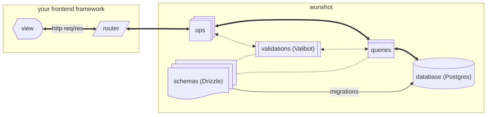

import {
  Card,
  CardGrid,
  LinkButton,
  LinkCard,
} from "@astrojs/starlight/components";
import TypescriptLogo from "../../assets/images/typescript.svg";
import ValibotLogo from "../../assets/images/valibot.svg";
import DrizzleLogo from "../../assets/images/drizzle.svg";
import PostgresLogo from "../../assets/images/postgresql.svg";

<section class="-mt-6 mb-10 *:shadow-md *:p-6 *:max-w-prose *:mx-auto *:text-center *:*:inline-block *:*:!text-sm">
  <Card title="Powered By">
    <ul class="list-none mx-auto grid gap-4 grid-cols-2 p-0 max-w-fit sm:grid-cols-4">
      <li class="mt-1 flex flex-col items-center gap-2">
        <TypescriptLogo width={48} height={48} />
        <a href="https://www.typescriptlang.org/" target="_blank">
          Typescript
        </a>
      </li>
      <li class="flex flex-col items-center gap-2">
        <ValibotLogo width={48} height={48} />
        <a href="https://valibot.dev/" target="_blank">
          Valibot
        </a>
      </li>
      <li class="flex flex-col items-center gap-2">
        <DrizzleLogo
          width={48} 
          height={48} 
          style="background-color: #121212; border-radius: .5rem;"
        />
        <a href="https://orm.drizzle.team/" target="_blank">
          Drizzle ORM
        </a>
      </li>
      <li class="flex flex-col items-center gap-2">
        <PostgresLogo width={48} height={48} />
        <a href="https://www.postgresql.org/" target="_blank">
          PostgreSQL
        </a>
      </li>
    </ul>
    

      This stack gets first-class support, but most of the code is portable to
      your validator and database of&nbsp;choice
    

  </Card>
</section>

<Card title="The missing link between data and server in the TS ecosystem">
There are infinite ways to get your data in and out of database and nearly as many libraries to help you do so.
But all that freedom comes with the costs of option paralysis, fragmentation, and churn.

Unlike a traditional library, wunshot only provides code patterns and conventions with some sensible defaults.
There&apos;s **no api** to learn, **no magic abstractions**, and **minimal dependencies**.
That means you can cut through the noise, start building, and worry about the next rewrite from your yacht.

**If you understand the diagram below, you already know most of what you need to start implementing wunshot.**
(And if you don&apos;t, [the guides are here to help](/getting-started/the-wunshot-way#architectural-overview)!)

</Card>

{/* vv Add this section once the docs for these modules are complete vv */}

{/* ## Jump In

<CardGrid>
  <LinkCard
    href="/getting-started/base"
    title="Getting Started"
    description="Build your foundation"
  />
  <LinkCard
    href="/activities-log"
    title="Activities Log"
    description="Create an audit trail"
  />
  <LinkCard
    href="/authentication"
    title="Authentication"
    description="Sign-in / sign-out and manage user sessions"
  />
  <LinkCard
    href="/ratelimiting"
    title="Ratelimiting"
    description="Stop bad actors or overzealous users from overloading your system"
  />
</CardGrid>  */}

## Highlights

<CardGrid stagger>
  <Card title="Single Source of truth" icon="seti:db">
    All the data you need transferred in a single database connection. Less time
    spent synchronizing across services. Faster page loads. Easily manageable
    PII.
  </Card>
  <Card title="Modular" icon="seti:config">
    Take as much or as little as you want from wunshot. Incorporate with your
    existing codebase or start a new project from scratch.
  </Card>
  <Card title="Copy-Pastable" icon="add-document">
    Get immediate hands-on control. If you disagree with any of the patterns,
    you have the power to change them - no pull request required!
  </Card>
  <Card title="End-to-End Type Safety" icon="seti:typescript">
    Never wonder what data is available. Types flow from Drizzle and Valibot
    through your app logic and into your frontend.
  </Card>
  <Card title="No Frontend Lock-in" icon="pencil">
    Build with your preferred framework. The wunshot modules return plain
    javascript objects in a standard format so you don&apos;t need to worry
    about special adapters or compatibility.
    {/* Nextjs starter template available with more coming soon.  */}
  </Card>
  <Card title="Deploy Anywhere" icon="rocket">
    Run wunshot on a server, a vps, or your favorite serverless platforms.
    Designed to be runtime and platform agnostic.
  </Card>
  <Card title="Best Practice Batteries Included" icon="seti:folder">
    Keep your data secure, efficient, and auditable. Baked-in patterns for
    validation, prepared queries, cascade handling, error handling, and
    standardized responses.
  </Card>
  <Card title="Consistent Structure" icon="seti:default">
    Spend less time wondering how to organize and more time building. Clear
    predictable patterns ensure consistency across your codebase.
  </Card>
  {/* <Card title="Immaculate Vibes" icon="comment-alt">
    Vibe-coders welcome! The predictable patterns allow LLMs to easily generate
    code that follows wunshot conventions.
     
    RAG + MCP coming soon.
  </Card> */}
  <Card title="Functional Source Licensed" icon="document">
    You are free to use the code pretty much however you&apos;d like, except
    developing competitors to wunshot.
     
    If you are training a commercial LLM and will be providing wunshot modules
    in the response, [open an issue on
    GitHub](https://github.com/lotap/wunshot/issues) or [message me on
    X](https://x.com/lotap_dev) for a special license.
     
    <a href="https://fsl.software/" target="_blank">
      [Learn more about the Functional Source License](https://fsl.software/)
    </a>
  </Card>
</CardGrid>
<section class="text-center">
  <LinkButton href="/getting-started/" icon="right-arrow">
    Read the Docs
  </LinkButton>
   
  <LinkButton
    href="https://github.com/lotap/wunshot"
    icon="external"
    variant="secondary"
  >
    View on Github
  </LinkButton>
</section>
