The auth modules utilize a combination of JWTs and a `sessions` table to manage user authentication state.

This approach provides a high level of security while minimizing roundtrips to the database.

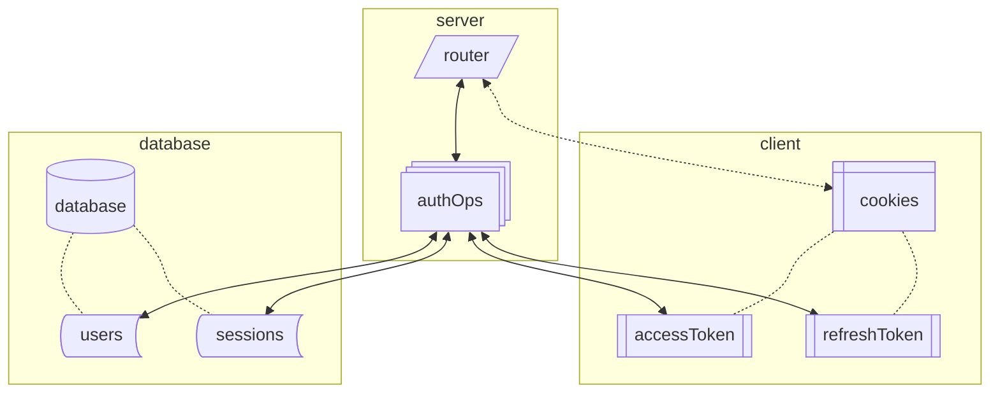

## Fundamentals of Auth

### What is a Session?

### What is an accessToken?

### What is a refreshToken?

### Why use JWTs?

### Why use Cookies?

### Why use a Database?

## Auth Flow In Depth

### Sign Up (Create User)

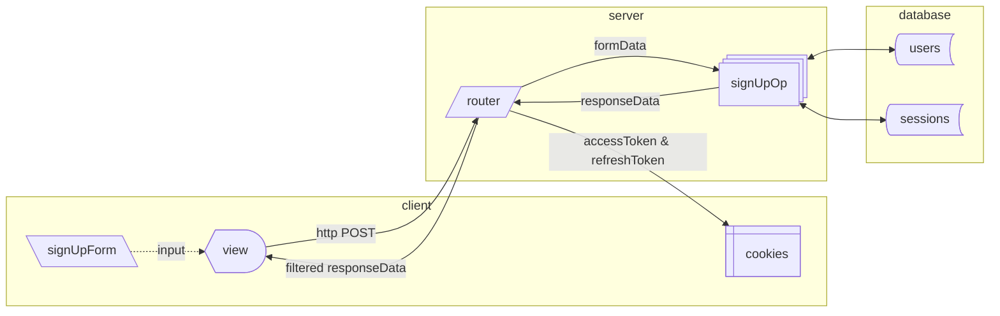

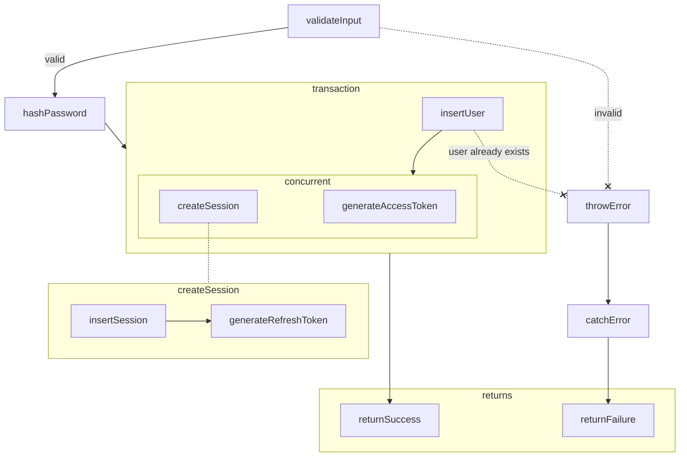

### Sign In

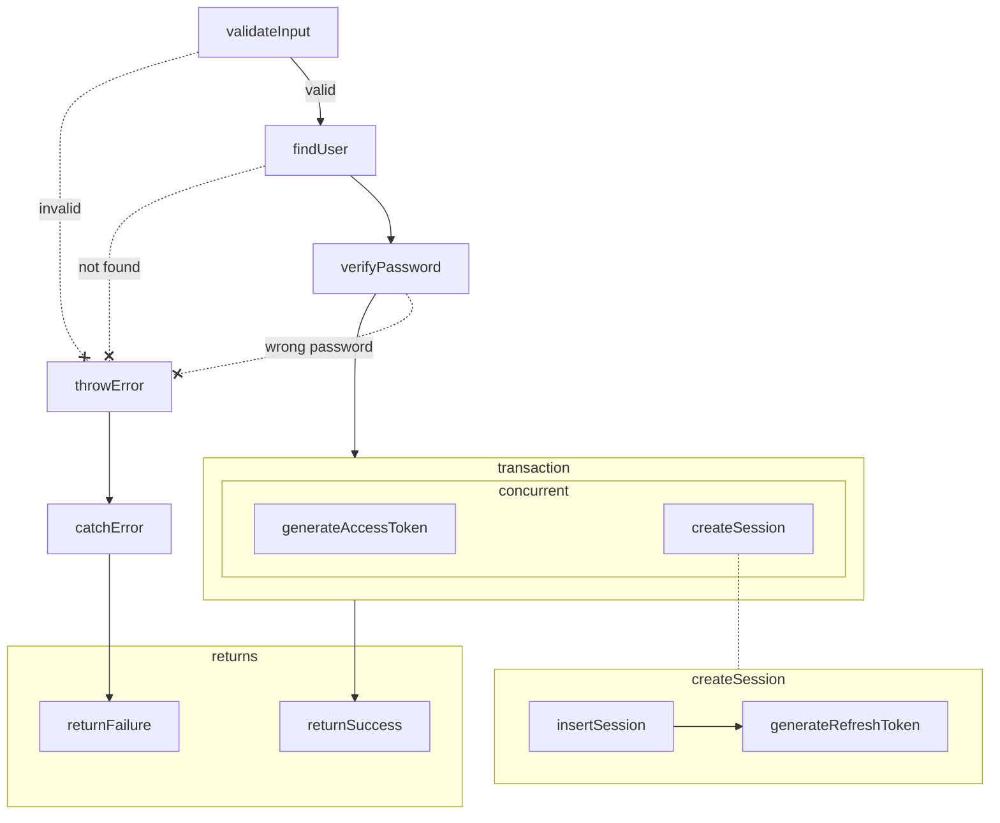

### Verify Access

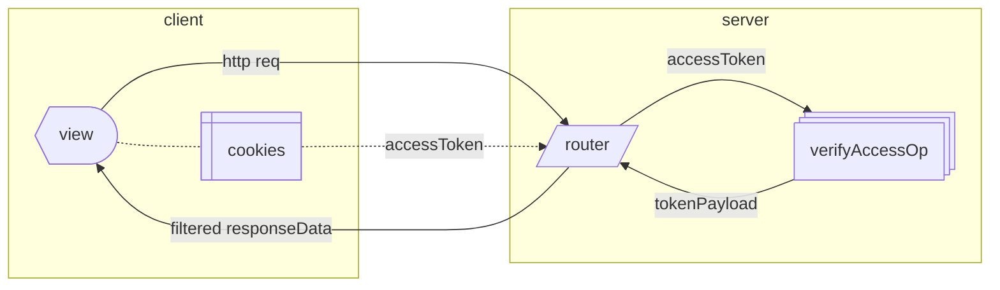

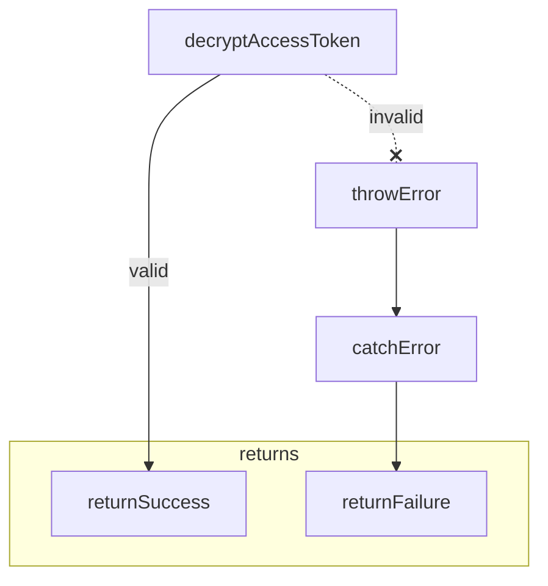

### Refresh

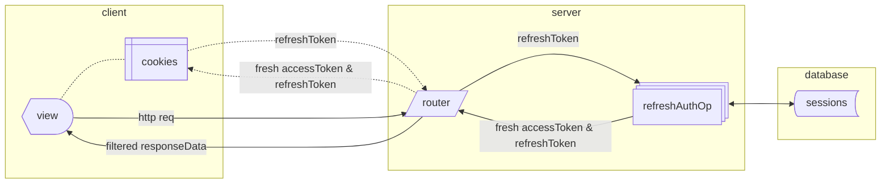

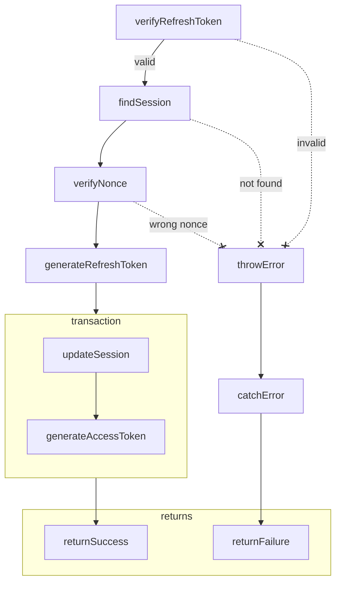

### Sign Out

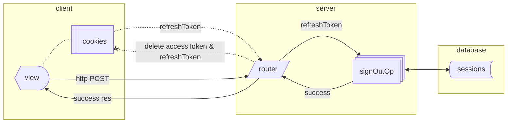

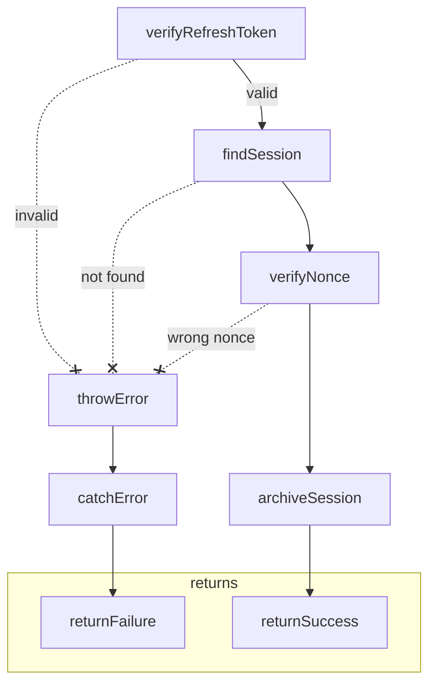

### Sign Out All

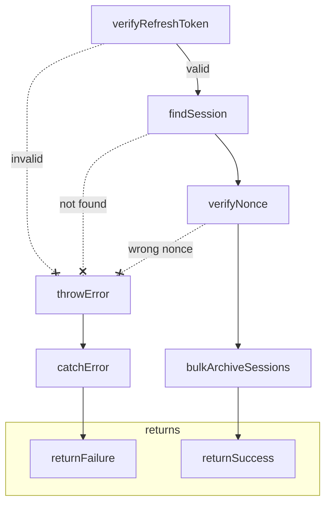

---

An encrypted `accessToken` with a short expiry is used for short-term access and a `refreshToken` can be used to extend the period as signed-in.

The `refreshToken` works by checking the values stored in the token against the `sessions` table.
