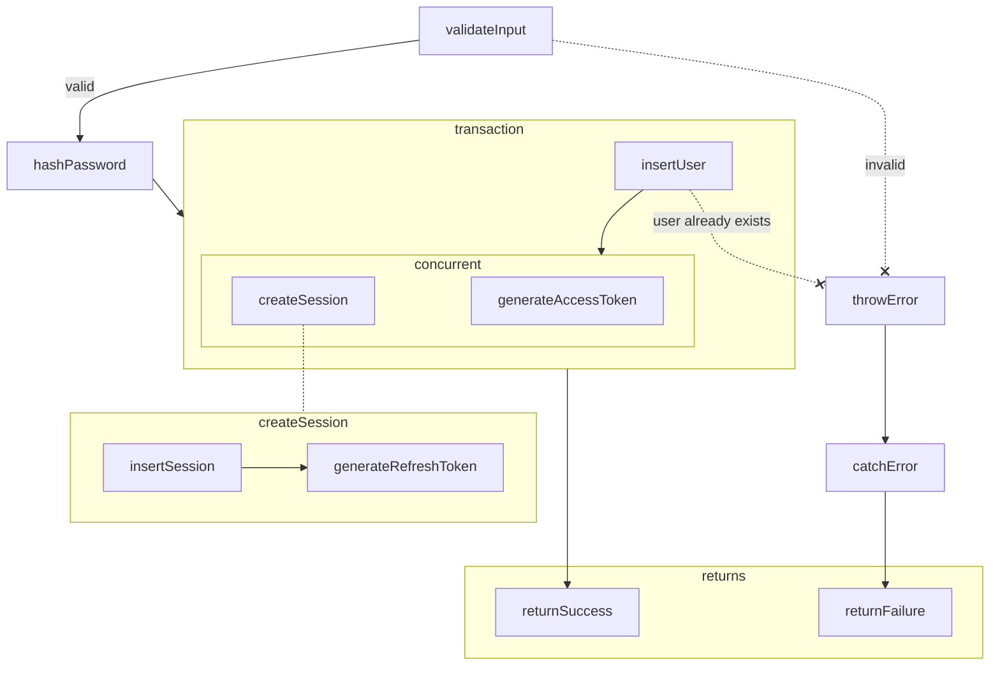
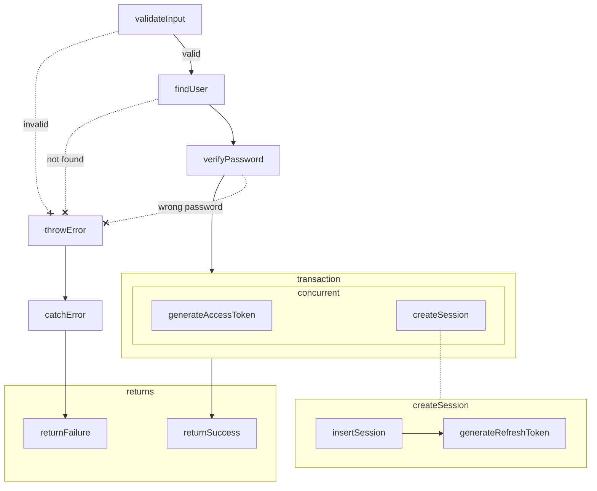
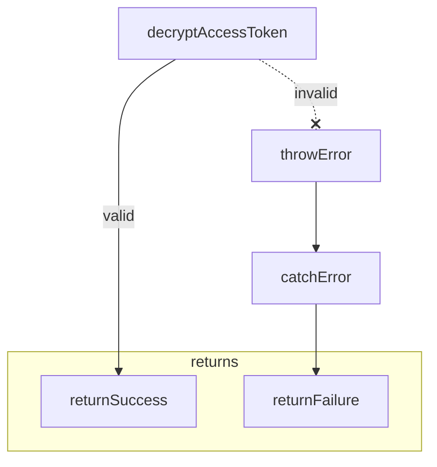
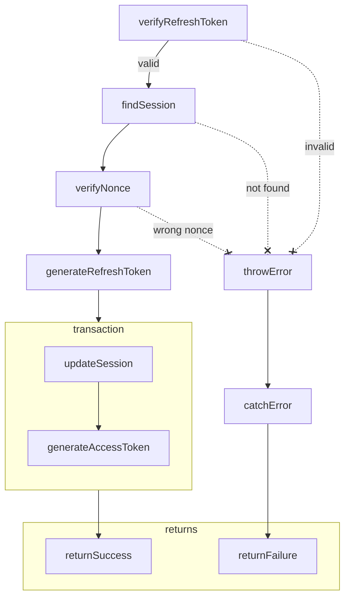
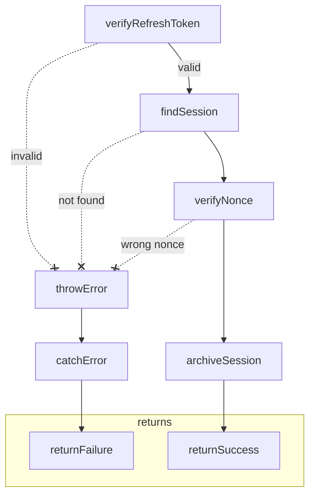
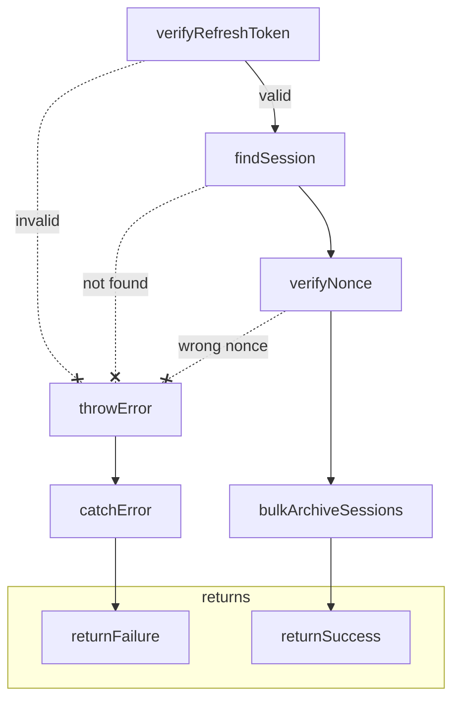

### Sign Up (Create User)

```mermaid
flowchart

validateInput
hashPassword
insertUser
insertSession
generateRefreshToken
generateAccessToken
returnSuccess

throwError
catchError
returnFailure

subgraph createSessionBreakout [createSession]
  insertSession --> generateRefreshToken
end

subgraph concurrent
  generateAccessToken
  createSession
end

subgraph transaction
  insertUser --> concurrent
end

subgraph returns
  returnSuccess
  returnFailure
end

validateInput -- valid --> hashPassword --> transaction --> returnSuccess

validateInput -. invalid .-x throwError
insertUser -. user already exists .-x throwError

throwError --> catchError --> returnFailure

createSession -.- createSessionBreakout
```

### Sign In

```mermaid
flowchart

validateInput
findUser
verifyPassword
insertSession
generateRefreshToken
generateAccessToken
returnSuccess

throwError
catchError
returnFailure

subgraph createSessionBreakout [createSession]
  insertSession --> generateRefreshToken
end

subgraph concurrent
  generateAccessToken
  createSession
end

subgraph transaction
  concurrent
end

subgraph returns
  returnSuccess
  returnFailure
end

validateInput -- valid --> findUser --> verifyPassword --> transaction --> returnSuccess

validateInput -. invalid .-x throwError
findUser -. not found .-x throwError
verifyPassword -. wrong password .-x throwError

throwError --> catchError --> returnFailure

createSession -.- createSessionBreakout
```

### Verify Access

```mermaid
flowchart

decryptAccessToken
returnSuccess

throwError
catchError
returnFailure

subgraph returns
  returnSuccess
  returnFailure
end

decryptAccessToken -- valid --> returnSuccess
decryptAccessToken -. invalid .-x throwError

throwError --> catchError --> returnFailure
```

### Refresh

```mermaid
flowchart

verifyRefreshToken
findSession
verifyNonce
generateRefreshToken
updateSession
generateAccessToken
returnSuccess

throwError
catchError
returnFailure

subgraph returns
  returnSuccess
  returnFailure
end

subgraph transaction
  direction TB
  updateSession --> generateAccessToken
end

verifyRefreshToken -- valid --> findSession --> verifyNonce --> generateRefreshToken --> transaction --> returnSuccess

verifyRefreshToken -. invalid .-x throwError
findSession -. not found .-x throwError
verifyNonce -. wrong nonce .-x throwError

throwError --> catchError --> returnFailure
```

### Sign Out

```mermaid
flowchart

verifyRefreshToken
findSession
verifyNonce
archiveSession

throwError
catchError
returnFailure

subgraph returns
  returnSuccess
  returnFailure
end

verifyRefreshToken -- valid --> findSession --> verifyNonce --> archiveSession --> returnSuccess

verifyRefreshToken -. invalid .-x throwError
findSession -. not found .-x throwError
verifyNonce -. wrong nonce .-x throwError

throwError --> catchError --> returnFailure
```

### Sign Out All

```mermaid
flowchart

verifyRefreshToken
findSession
verifyNonce
bulkArchiveSessions

throwError
catchError
returnFailure

verifyRefreshToken -- valid --> findSession --> verifyNonce --> bulkArchiveSessions --> returnSuccess

verifyRefreshToken -. invalid .-x throwError
findSession -. not found .-x throwError
verifyNonce -. wrong nonce .-x throwError

throwError --> catchError --> returnFailure

subgraph returns
  returnSuccess
  returnFailure
end
```
